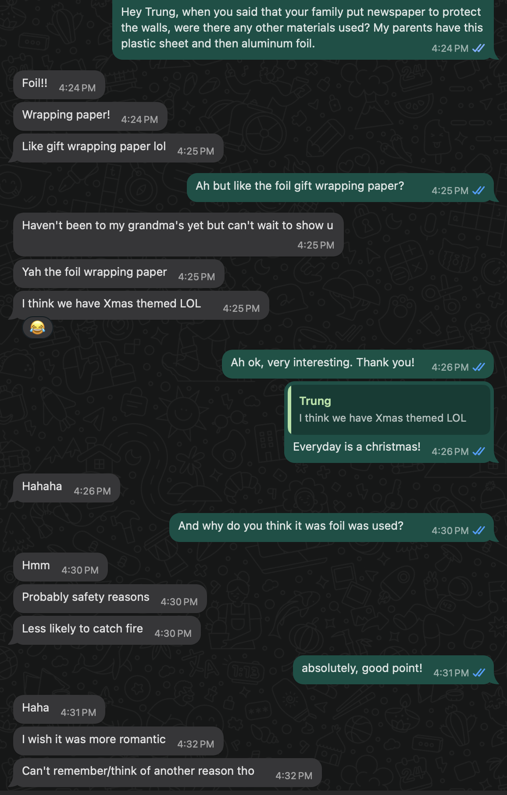

# Peter Ha
- Soft Robots
- Master Media Design + O2R

## Area of Intervention
Vietnamese family altars and the rituals around them in a western living context. 

## Research Question
What new relationships can we have with traditional altars?

## Research
I focused my research methods on gathering online commentary to gain insights into the broader collective perspective. From there, I shifted to a more personal approach, conducting interviews and collecting drawings and photos from my network of family and friends. This allowed me to deepen my understanding through both wider societal views and intimate, firsthand experiences.

### Online Collective 

### Interviews & Conversations

### Drawings

### Photos

## Insights
People's adaptaption of altars and departure from traditions to meet their needs in western context and on individual/family basis. For example:
- Reflective protective materials on ceiling and walls
- Name on a piece of paper instead a photo
- Simple picture frame with print out stickers
- Fake flowers or electric candle lights
- Altar for family dog

## First ideas & prototypes
Show three of your prototypes.

### HAR (Hold and Release) v1
An inconspicuous robot that lives on the ceiling directly above the joss bowl. HAR comes down when smoke reaches it to hold the smoke inside of itself and to release it evenly through its bubbly skin.

### HAR v2
In this variation, HAR is a living entity that stays on the altar. Only when incense is burned does HAR turn on, navigate to the joss bowl, and extend itself to cover the smoke. Since HAR is made of porous material, it will absorb some of the smoke while still allowing some to pass through.

### Link
Designed to bring an altar outside the home, allowing your deceased loved one to be part of your daily life beyond the household. Link operates by using a monitor attached to your heart and when pressed, it connects to the photo frame on the altar through beaming light signals.

## Next Steps
Further explore Link and find novel interactions and flush out different scenarios outside the home.