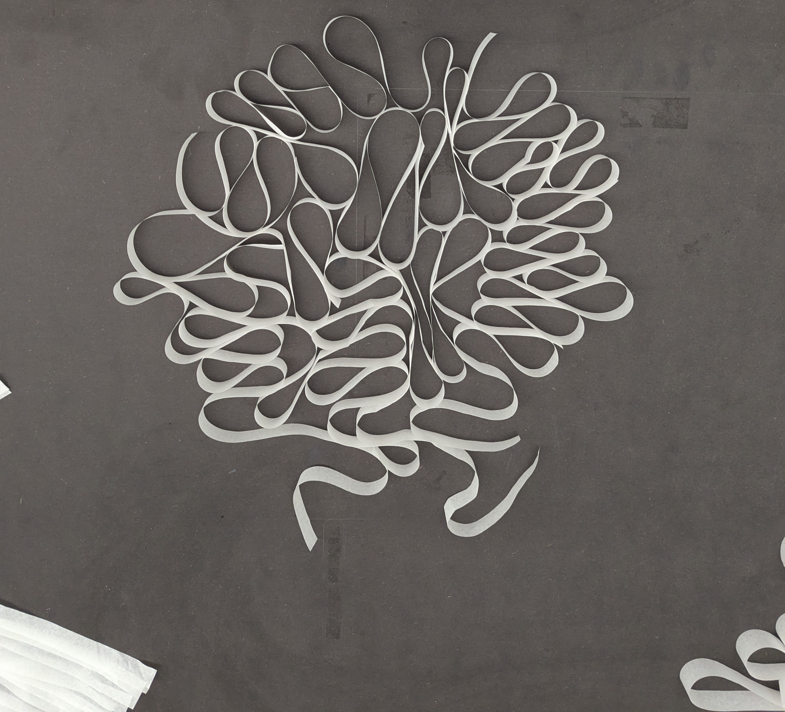

# Peter Ha
- Soft Robots
- Master Media Design + O2R

## Burning Desire to Remember

## Research Question / Area of Research
Living in a globalized digital world, what new relationships can we have with traditional altars?

## Pitch
An incense that sends your everyday  sentiments to the afterlife.

## Prototyping Research
Focused on how to represent the incense including the smoke in paper form. A lot of the exploration is trying to capture the fluidity of smoke while maintaining some structure to represent the stick. I drew inspiration from the sea urchin since when incense sticks are bundled together, they have a similar form. But primarily, I took inspiration from the incense stick itself and try to re-imagine it in paper format.

To hear and see some in movement, here is an [explainer video](https://www.instagram.com/p/DCZI73RMu5Z/).

## Key Prototype
The concept is to replace traditional burning rituals in ancestor worship with a way to send your sentiments to the afterlife. Huong interprets messages sent from your device to the bowl, changing the incense and smoke movements and colors to reflect the emotions conveyed.

## User scenario

## Next Steps
Figure out electronics, design box, bowl and messages, refine the incense by testing lighter paper.