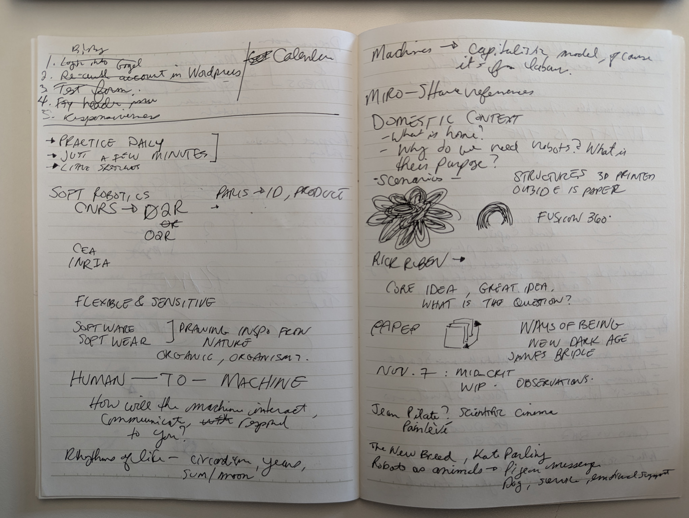
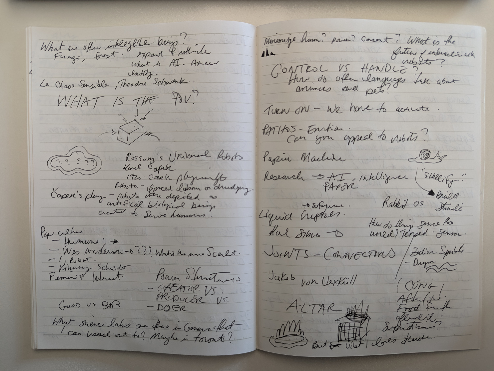
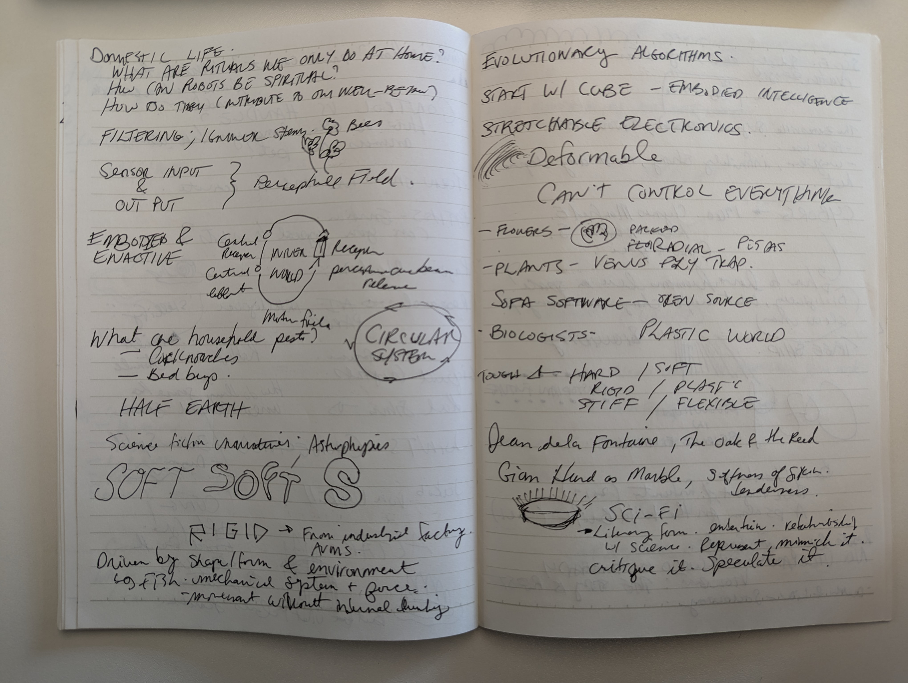
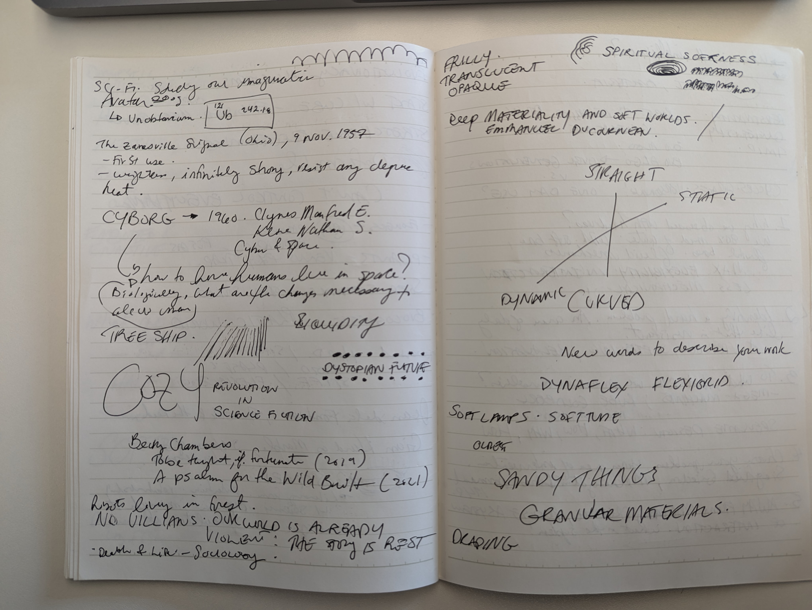
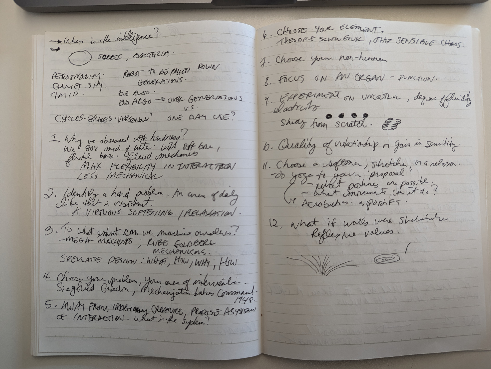

# Kickoff

## Notes from Presentations

## Image references on [Miro](https://miro.com/app/board/uXjVLUDtyxg=/)

Inspired by nature, the water in Geneva, the way mist forms around a bridge, the shadows on buildings, the light reflecting off of materials

## Keywords
cozy
dynaflex
flexigrid
deformable
companion
cybernetics
flexible
sensitive
evolutionary algorithms
stretchable