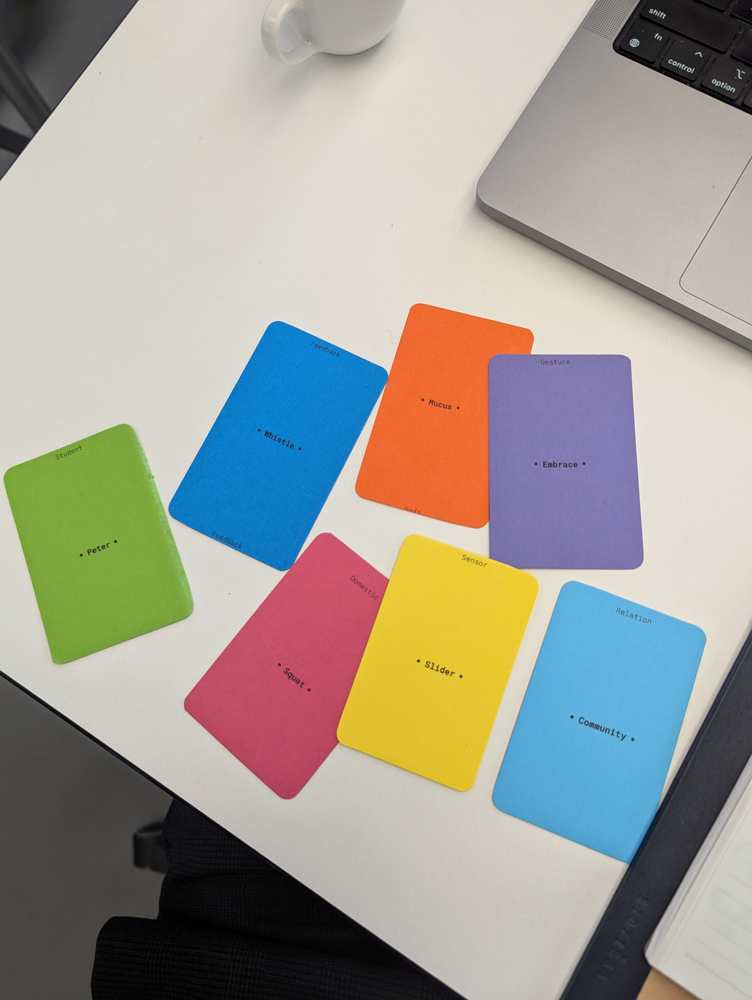
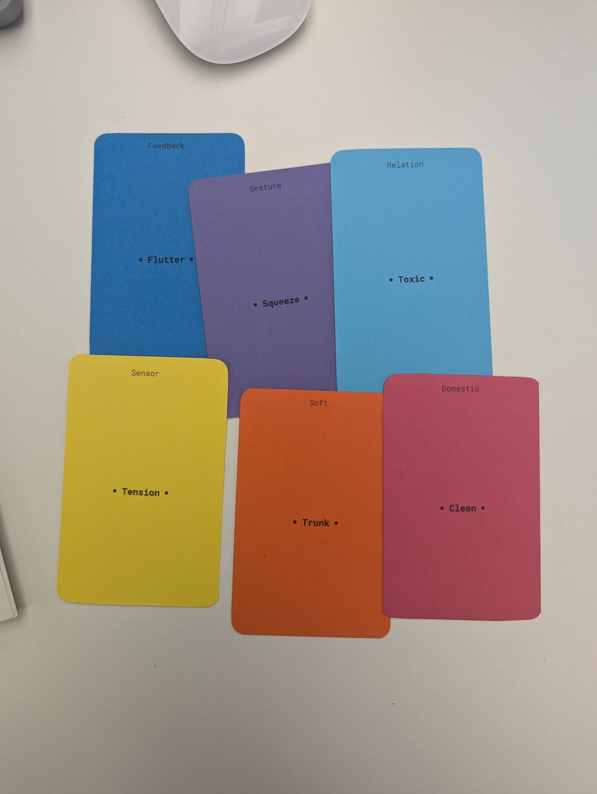
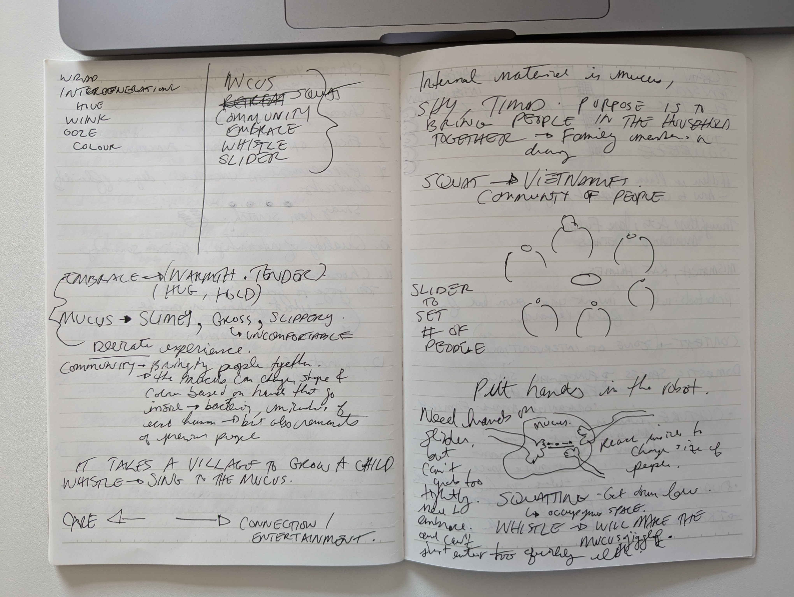
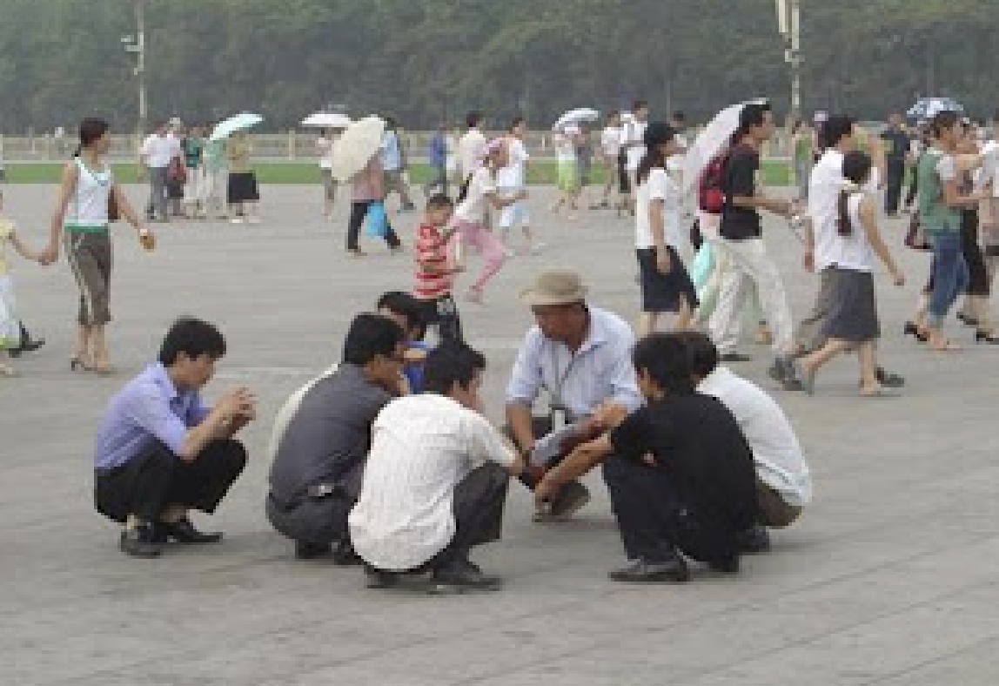
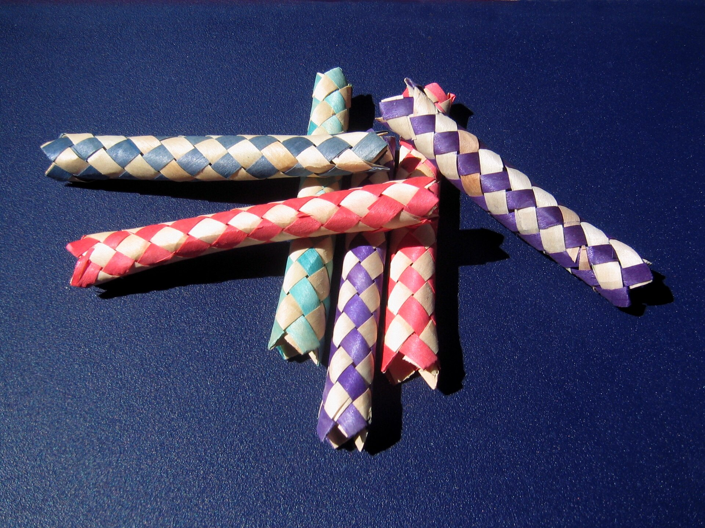

# Prototyping with Card Prompts
## Morning
- Add images from brainstorming and prototyping session. 
- Slime Baby 

A soft robot that takes a village to raise
- TT2000

A fluttering trunk that sucks up the bad energy in your home

Another variation of Slime Baby is more of a mediatiation between people when there's an argument. For example, household with my siblings. In order to get them to get along, similar to a timeout, have them hold onto a communal slider inside the soft robot. They have to squat since the robot lives on the ground but the squatting is rooted in my background as being Vietnamese.

The squatting also gets people to be close to the ground, crouching over the robot in this more intimate interaction.
Vietnamese people are also quite musical, perhaps because the language is tonal but I grew up with parents karoking and parties of family friends, of course there was always karoke too. So to mediate between an argument between siblings, the only way they can communicate with each other and the robot is through whistling. The intended goal is that once the heart rates of each participant has lowered, then they can be release by the robot. 

Kind of similar idea of a Chinese finger trap, where two people get trapped in this puzzle but the goal is to actually bring the fingers closer in order to release from the trap.

Note: When I saw slider as the sensor, I immediately went into thinking of a slider as a linear item with a circular button, similar to a web slider. But in the context of a soft robot, how can we re-think typical sensors and their forms, but also how they behave. 

That's how I came up with the slider for the Slime Baby, where the sliders are curly, as if it's their organs, similar to those kids toys and I can imagine the knobs having different forms.

## Afternoon
Zone of Interest: Vietnamese ancestral altars