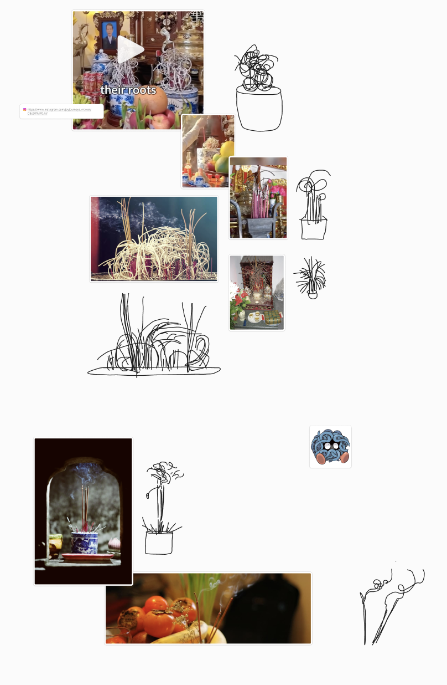

# Preliminary Research and Observations

Tasked with choosing a specific area of interest within the domestic space and do a series of observations. My chosen space is Vietnamese ancestral altars since this is a common tradition among Vietnamese people and it's a tradition I would like to carry on.

One challenge I have is the lack of access to friends and families since they are living all over the world and do not know many Vietnamese people in Geneva. This means my starting point has been thinking about the brief, making connections with current living space, photos on my camera roll and looking at content online.

Had one-on-one and next steps to develop interviews and gather visual research of altars. Feedback was questions were dry and avoid close-ended questions.

[View FigJam](https://www.figma.com/board/hWrn9X8vgzAbX2ZcklfhDN/Soft-Robotics---Domestic-Research?node-id=0-1&t=7BHez2IeCIncwUsG-1) with all research.