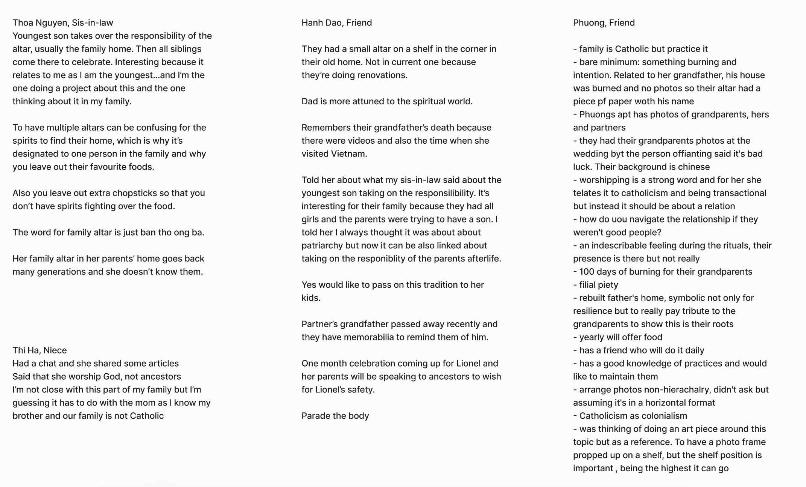

# Informal Interviews

To keep me organized and track interviews, there's a spreadsheet of people who I have talked to and who I would potentially like to reach out too.

## Interview Notes

Have some converations recorded on video as well.
One big question I have after talking to my sis-in-law is "If we live in a globalized world and siblings are dispersed, how can we still honour traditions but adapt to our new reality?"

## Drawing Directions

Prompts for people to draw their relationship to the altar.

