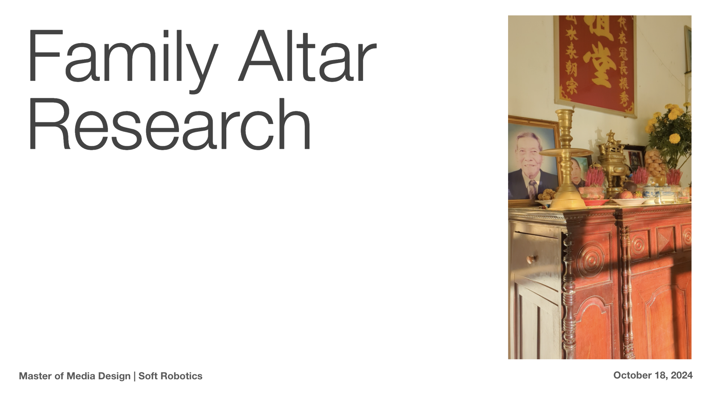

# Preliminary Research Presentaton

[View PDF](images/Soft%20Robotics%20-%20Domestic%20Research%20-%20Family%20Altars.pdf)

Feedback, no more PDF presentations. Reasoning for this format was to help me formulate my initial research into a more concise format since I already have the [FigJam](https://www.figma.com/board/hWrn9X8vgzAbX2ZcklfhDN/Soft-Robotics---Domestic-Research?node-id=30-42&t=7BHez2IeCIncwUsG-1) where it's more of a mess.

Other notes were to re-formulate the drawing prompts and keep it low-fi. Don't need to get qunatitative data, looking for qualitative and the relationships with people:
- Draw the most important part of the altar
- Draw the energy around the altar (or something more approachable). Still debating on what to do for this last question. 

Another observation I've had from looking at photos of altars is that there's people who use cigarettes as replacement for incense which I found an interesting choice. There's also articifial flowers and electric lights that look like candles. I wonder where we are heading and what would be disrepctful to have on an altar. 

Conversation with Lise - The practice of holding candles in church service and you pay money to use a fake candle. 

Bruno - Put photos of deceased loved ones near statue or painting or a simple representation of Saint Marie.

Liliu - "if you are interested in the root of the chinese character “事”, you mention its verb meaning as “to serve”, but the more usual meaning is its noun one as “things (very referred to experiences and stories)” and very closely connected with the “物”, meaning objects, so the “事物” the word, is like things and objects and always been mentioned together. maybe you can take this as a connection of hidden stories and the representative alter"

Karina - Long exposure photography of incense.

Again, big challenge for me is access. Although through interviews, I am learning a lot about this tradition and people's relationship with altars and rituals.
