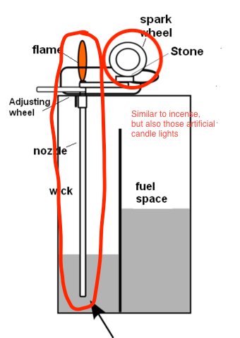

# Ideation

Where can this robot situate itself?

## On the Altar
- To keep the altar always clean and pristine. If only a shelf then it only cleans on the shelf but if the altar is more grand, it would move all around it, it would kind of be like a living organism that always stays on the altar. What are those sea creatures that people put in tanks for cleaning? That's the idea essentially. But then how does the organism respond to the altar environment? If this direction, then look more into these cleaning organism.
- To push the incense air further upwards or to help it disperse further. 
- Specifically, could the soft robot be intertwined with the incense? It gets triggered by the incense through heat, smoke? 

## Around the Altar
- Inside the altar if not a shelf

## A Soft Robot that Helps with Death
- Is there a life cycle? One insight I had from conversations with people is that people are not thinking about death and it can be a taboo or superstitious subject. What if the life cycle of the robot coincides with the length of burning an incense? Each time the robot comes to life and dies in this timeframe.
- With new generation, there's a different personality but has a small part of the previous generation? 

Soft robot that is very low on the ground but extends very high over time

A robot that is on display vs a robot that is hidden
- On display is when there are special ocassions. As if they are part of the family. 
- Hidden, only comes out for special ocassions. 

## Robot that sticks to the ceiling

Interaction is with smoke

What is the sensation you get from smoke? 
- Fire - suffocating
- Mist - calming 

Interaction | Feedback
- Prick → Jumps
- Stick → Hums
- Cover → Shakes when there's too much ash on it
- What is it called when you use a lighter, what is this interaction? → Cycle
- Light (as in, lighting with fire) → Turns on

Input | Output
- Pressure → Movement
- Roll
- Heat → Glow

Other words
- Bow
- Reach
- Idle / Reflective
- Eating

## Talking to a robot

### Context
This project will explore the domestic context of Vietnamese family altars and the practices surrounding them. Our objective is to design a soft robot based on our observations.

### Definition
A common tradition among Vietnamese people is to have an altar in their homes to pay tribute and respect to members of their families that have passed away. It’s also a way to stay connected to loved ones and a way to mourn yet celebrate their life and death. While their physical form is no longer present, their spirits remain.

What I am not interested in, are death rituals outside of the home. I am open to other cultures and other death practices that happen in the home. 

### Keywords
- Vietnamese
- Altar
- Incense
- Portrait
- Celebration
- Death
- Spirituality
- Light
- Smoke
- Respect
- Honour
- Roots
- Shelf

### Key Observations
Had converations with family and friends about family altars. Most haven't thought about them but they said they would like to carry on this tradition.

To have an altar, you just need something burning and intent.

Can be bad for spirits to have multiple altars around the world for your family since the spirits may not know where to go.

Based on this information, what are some interactive devcices that can be around this topic?

### ChatGPT 4o Reponse

Based on your project and the themes surrounding Vietnamese family altars, here are some ideas for interactive devices that could connect with the tradition while integrating technology and soft robotics:

1. Incense-Powered Light Sculpture: A soft, fabric-based robotic sculpture could respond to the burning of incense. As incense smoke rises, sensors detect it, and the sculpture gently inflates or unfurls, symbolizing the spiritual presence of ancestors. This could also serve as a calming, meditative object during rituals.

2. Memory Lamp with Portrait Interaction: A soft robotic light fixture that interacts with ancestral portraits. When family members approach or touch the portrait, the lamp could softly change its brightness or shape to reflect connection and presence. It could gently pulse or glow as if the spirit is responding.

3. Breathing Altar Mat: A soft robotic mat placed in front of the altar that subtly “breathes” (inflates and deflates slowly), mimicking a meditative or spiritual rhythm. When someone kneels to pray, sensors could make it respond more actively, symbolizing the connection between the living and the spirits.

4. Gesture-Activated Spirit Shelf: A shelf integrated with soft robotic components, where gestures like lighting incense or bowing cause parts of the shelf to gently move, reflecting respect and honor. It could use light to enhance the sacred feeling of the altar, adapting to the intensity of the spiritual act.

5. Sound-Responsive Smoke Companion: A soft robot designed to sit near the incense, subtly moving or “listening” to sounds like chants or prayers. Its slow, fluid movements and expansion could imitate smoke and resonate with the calmness of the moment, reinforcing the spiritual atmosphere.

6. Interactive Ancestral Presence Indicator: A soft, glowing orb that “responds” to family gatherings or specific emotional atmospheres, symbolizing the unseen presence of ancestors. It could change its behavior based on sound levels or presence, subtly pulsing or moving as if the ancestors are listening.

These devices focus on creating subtle, interactive, and respectful experiences that align with the cultural and spiritual significance of family altars in Vietnamese homes.

#### Initial reactions to ChatGPT response
- Feel a bit uneasy towards creating a robot that is a representation of spirits
- The mediatative aspect is interesting but at the same time, would this take away focus from trying to be connected with family spirits by diverting attention to the robot?
- The idea of playing with a shelf...as a platform, as a place to serve, as a place for belongings and belonging. To shelve, to arrange...

### Short Paragraph Description of Soft Robot

The soft robot that I have in mind uses the interaction of smoke, in relation to lighting incense. Some sensations that come from smoke is the extreme of suffocation but when misty or flowy it can be calming. Where it could be potentially located is on the altar or on the ceiling. I am interested in the action of lighting, to use fire to turn on the robot or heat sensors. I am also inspired by mechanical lighters and the scroll wheel. 

From this messy description that is kind of vague, what do you make it in the context of this exercise?

### ChatGPT 4o Response

From your description, the soft robot seems to embody the duality of smoke — from its sometimes overwhelming, suffocating quality to its more serene, flowing, and calming state. The fact that you are considering fire, heat sensors, and the mechanical aspect of lighters and scroll wheels adds an interesting layer of interaction between tradition and technology.

Here’s how I interpret this in the context of your project:

1. Interaction with Fire and Heat: The idea of using fire to activate the soft robot could be linked to lighting incense. The robot might be designed to react when the incense is lit, triggering a soft, flowing movement that mimics the behavior of smoke. Heat sensors could detect the warmth of the flame and initiate the robot's actions, aligning with the spiritual and ritual significance of lighting incense.

2. Mimicking Smoke: The robot’s movements could reflect the fluidity of smoke, expanding, swirling, or undulating in a slow, rhythmic pattern. When incense is first lit, the robot could gradually move from a state of stillness (representing the calm) to more dynamic and free-flowing forms (representing the release of the spirit), offering a visual metaphor for the connection between the physical and spiritual worlds.

3. Mechanical Scroll Wheel Influence: The inspiration from mechanical lighters and scroll wheels suggests a potential tactile element. Perhaps, after lighting the incense, the user could interact with a scroll-wheel-like mechanism that alters the robot’s behavior. This could give users a way to "tune" the robot's response, allowing them to adjust the intensity of its movement or lighting in relation to the ritual.

4. Placement and Functionality: If the robot is located on the altar, it could serve as a centerpiece that responds to the act of worship and prayer, visually accompanying the offering of incense. If placed on the ceiling, it might create a more immersive experience, with its soft, undulating movements or changing light reflecting down onto the altar, enhancing the sacred space.

This concept connects deeply with the ritual of lighting incense, merging tradition with modern technology, while playing with the physical and symbolic qualities of smoke, fire, and heat in an interactive design.

## Reflections
There's something missing from the response. Perhaps it's the why, which could be a symtpom of my input to the AI since I'm still trying to figure out what is the why exactly. Maybe the why this robot exist is to soften death or to make our mortality more evident.

## With Gemini
Provided the same prompts to Gemini. Can read responses [here](images/The%20soft%20robot%20that%20I%20have%20in%20mind%20uses%20the%20inter....txt)
Interesting that the first response is more focused on digital products, minus the VR experience.

## Questions
As we move to a more technological and artificial world, how does this influence the future of altars, spiritual practices?

## Thoughts
From Coding Care magazine: Symbiosis, Earth as a single organism, which can then be asked of a house/home. How does each function of the house contribute to the organism, and if looking through this lens, specifically, what is the altar organism?