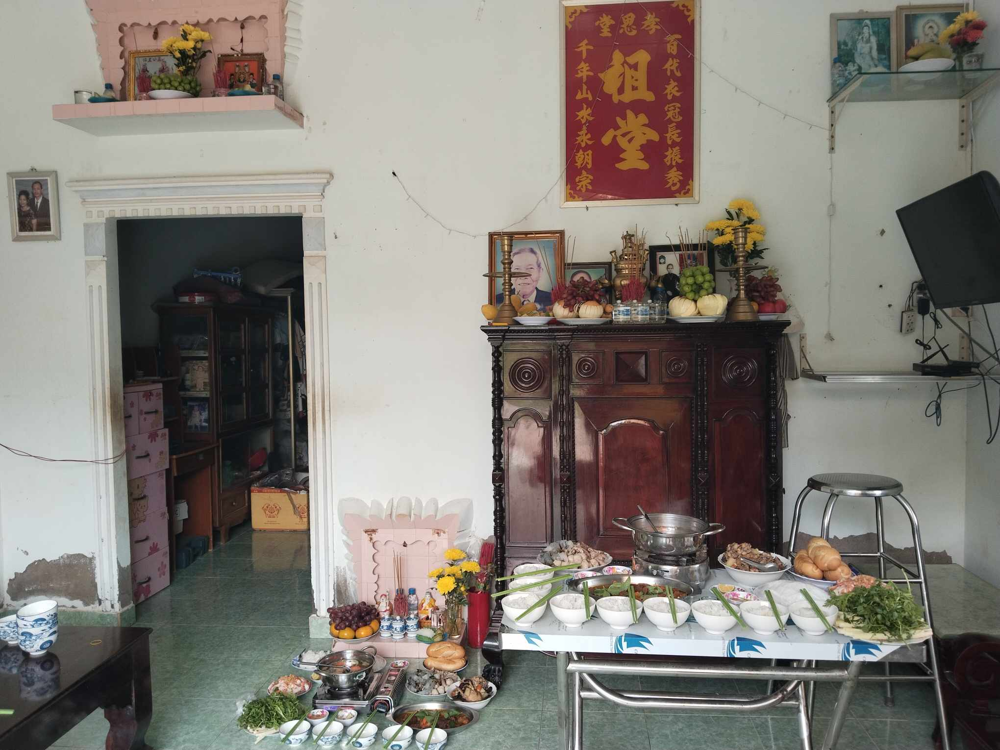
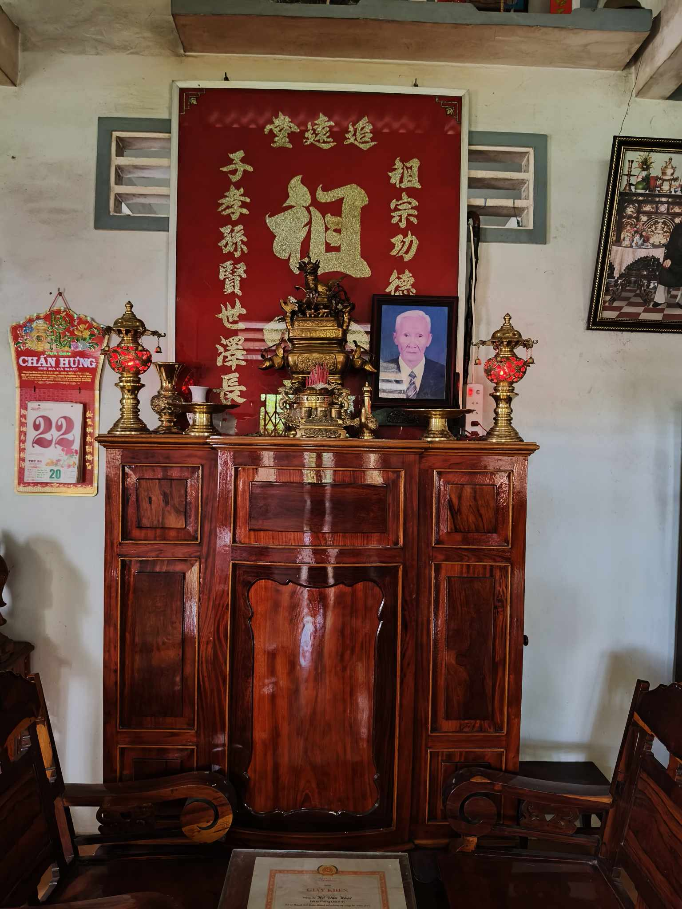
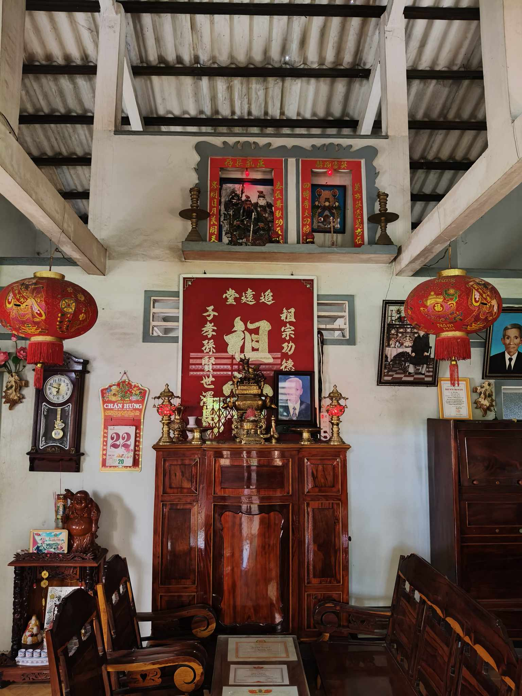
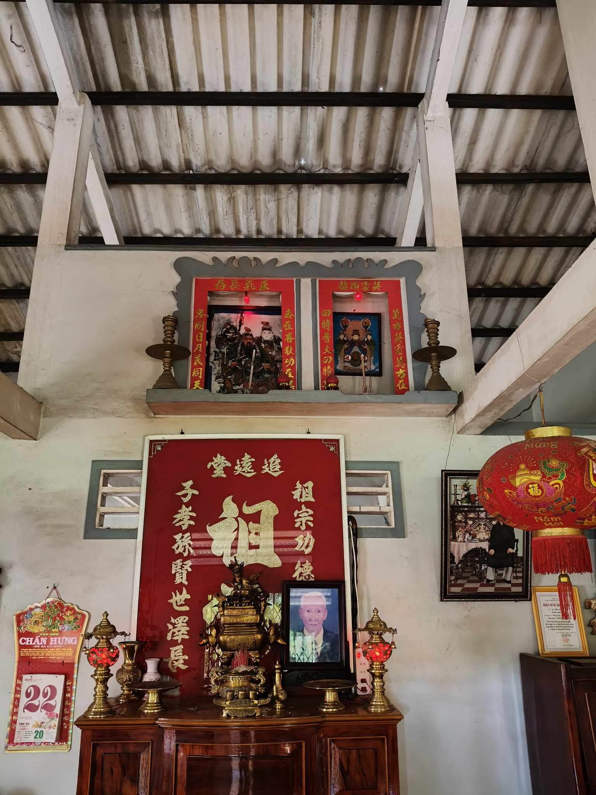
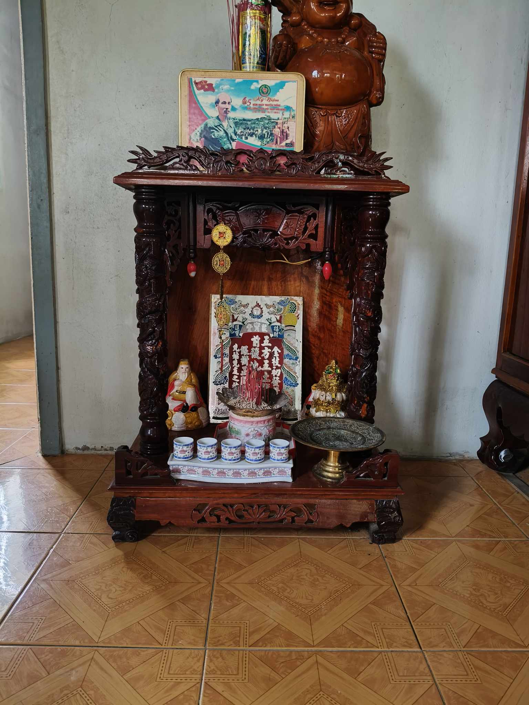
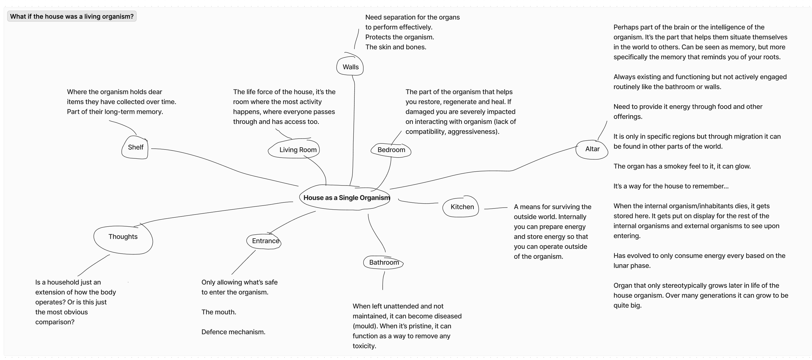
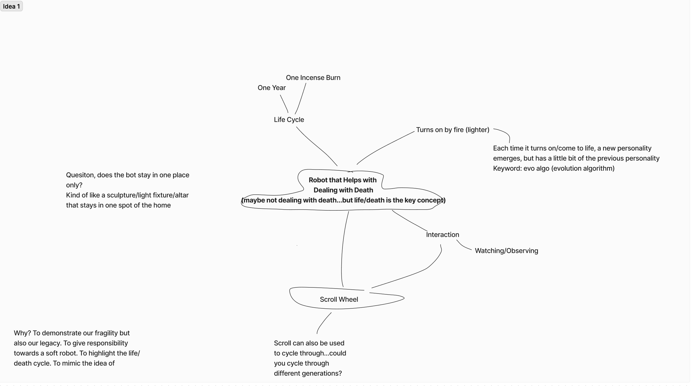
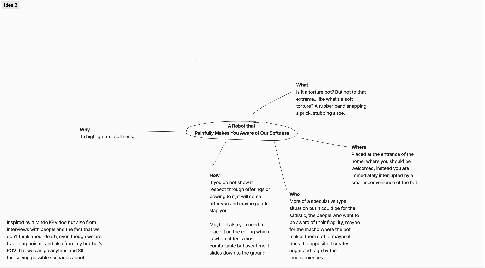
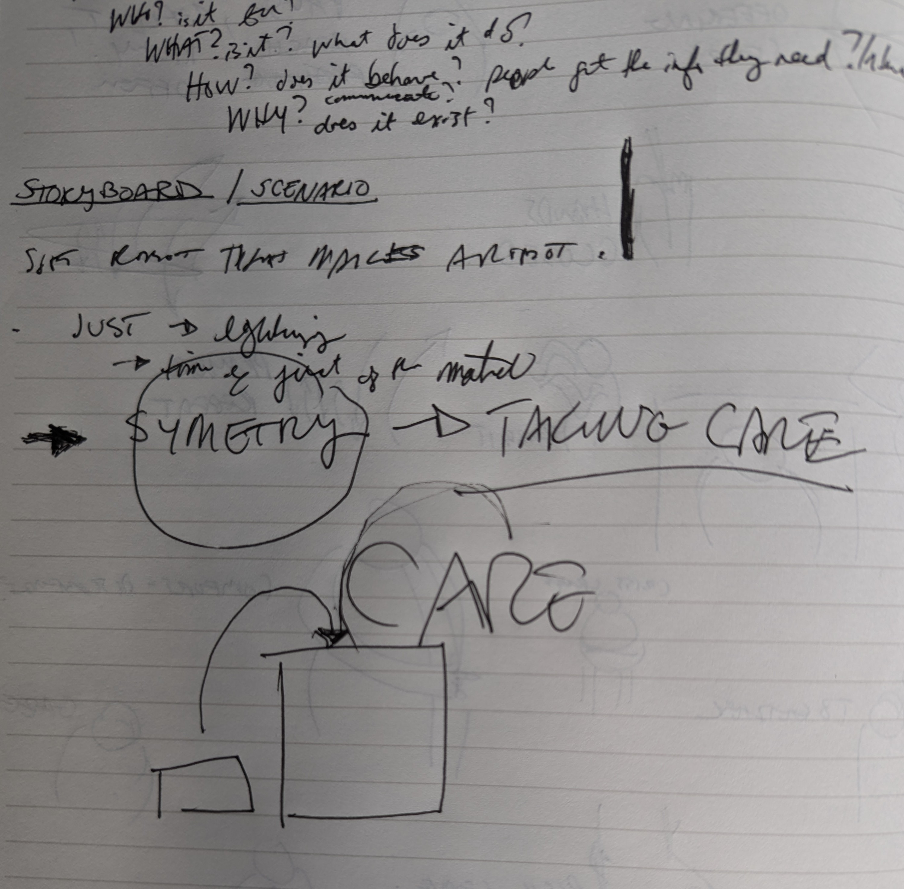

# Research Continues...

Updated instructions for visual research

## Messaging with Cousin

Takeaways
- Death anniversary of grandmother was 3 days ago
- Altar must be kept clean and pristine
- The most important part of the altar is the incense bowl
- The bowl can be cleaned at the end of year, only cleaned once
- For regular days, can be cleaned but don't touch incense bowl
- No fake fruits or flowers, fresh is best
- Main altar called "Bàn thờ chính"
- When asked about giving a name to the altar, they said they couldn't answer this because they have never considered giving it another name. Said they would consult with family but said it's ok, they don't have to.
- Offerings to to ancestors on special ocassions and on the 1 and 15 of each month of the lunar calendar 
- Altar needs to be placed by entrance, but also where there is light (at least according to customs of hometown Bac Lieu)
- Unneccesary electrical items should not be on or around altar

## Messaging with Nephew
In progress...
Takeaway
- When looking at altar, pray for good things and blessings, wishing for family to be healthy (interesting because it's not just about the afterlife, but also for the wellbeing of the living too)

- 

## Random Thoughts
- IG video of dad overreacting from a booboo to get a kiss from his daughter and caption read "Dad life makes you soft"...what if the robot is not only soft but it is to also make you soft?

## Mapping House as an Organism

## Ideas

## Feedback

How can care be part of the interaction? Caring for the altar or inspiring you to take care?
How can symetry be part of the design? But not just in the physical attributes, but in the interactions. Yin/Yang Physical/Spiritual