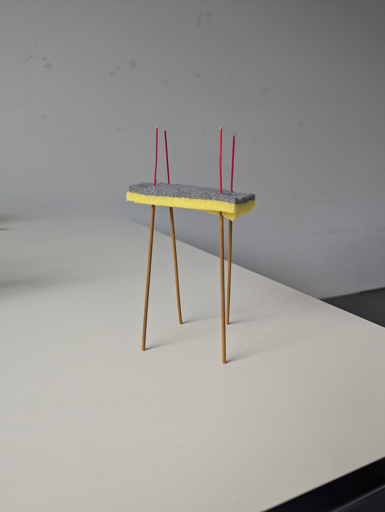
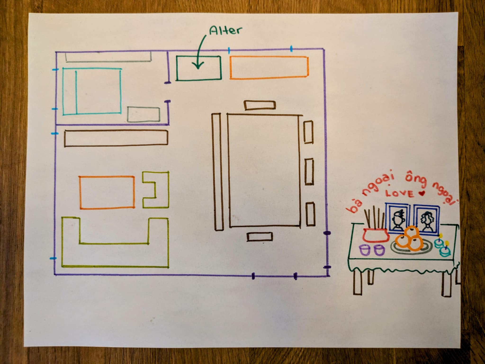

# Prototyping

Re-doing the performative card exercise but curated words that are specific to my domain area.

# Combo 1: Photo frame, stick, mirror, heart, curve

## V1 - Flow Frame

A frame that is connected to your heart. The perimeter has a fuzzy feel and changes fuzziness and colour based on your heart rate. The calmer you are, the fuzzier, while the more intense, the spikier the frame.

The idea is to visually represent what you are feeling when you are looking at a photo of a deceased loved one. Perhaps at the beginning, the frame is more intense looking but as time goes on, when someone looks at it, they are more at peace but never forget.

## V2 - Flow Frame on The Go

Adapting the previous version but take it on the go. When placed on the body, the frame acts as a "heart monitor" but instead for actually measuring health data, it  visually represents your feelings through colour and form. 

Could also see this being more incognito and it's to be worn underneath your clothes. Maybe a 1-to-1 experience with this soft robot / living thing that's attached to you always. And it's form is only revealed through the materials of your clothes. Loose clothes you can't see, but tighter clothes it will be noticeable or when topless.

## Home is where the heart is
An idiom that comes to mind. Take a piece of your family or home with you no matter where you are. 

Another idea is to activate the soft robot, you apply pressure so that it gets closer to your heart. This pressure then triggers a different form based on your heart rate. You press down on it when you want to be reminded of your roots or when you are thinking about your family. The roots come out of the bot and starts to wrap you.

## Combo 2: Shelf, Reach, Release, Heat, Balloon

Starting with symmetry and having two components attached.

As time goes on, they start to move away from each other. Perhaps they find their way on to shelves on their own, but always staying connected.

They start to move away through the heat of the incense or the smoke. 

As it moves away, a soft bubbly material emerges.

 And as the incense stops burning, it will then retract.

 Note: I like the idea of a balloon to visually represent our breath. What are other materials or objects that can represent the invisible?

 
 Talk in either end and it will start to move closer or further away. Kind of like telephone with walky talky but the robot would know if you're saying kind and nice things or negative things. Kind things get you closer to the person while negative moves you further away.

 ## Combo 3: Table, Eating, Mirror, Heart, Sponge

A bot where it requires multiple people to hold on to the top in order for the legs to move. Maybe there's something here with something that is exposed top and bottom. This contrast of something grounded and something high above.

Where does the eating come in? Looks like chopsticks, do the legs pick up food? But then why...and where does the food go?

Is there a way to trap smoke into the top area? It's eating the smoke...Light the robot, the spong heats up, and the top starts to gather smoke, which then prompts the legs to move. The mirroring aspect is the top and bottom part, maybe have the sticks be the same length but move in opposite directions?

## Smoke Catcher

A soft robot that can catch smoke and then disperse it evenly into space to avoid damaging ceiling and walls. Idea came at night and needed to get it down quickly as a sketch before forgetting.

## Shadow and Light
Interested in transluecent materials and their shadows or what other objects shadows look like as a way to show the softer side of a thing.

<video width="320" height="240" controls>
  <source src="images/PXL_20241024_141910296.TS.mp4" type="video/mp4">
</video>

## Chat with Friend in Toronto
Takeaways
- Grew up Catholic but family still practiced altar
- Grandma's place has a room dedicated to grandpa
- Incense burning is important and he remembers having newspaper or tinfoil to protect the wall and ceilings. Describe a dark spot and yellow stains. But with protective covering it would be white underneath.
- Never thought about having an altar for his parents but during our talk, came to the realization that he has an altar for his dog. There's a digital photo frame and they leave out treats for him.
- Interesting that there's a digital photo frame.

## Sis Drawings

Observations
- Placement in the dining room, because food is life.
- The altar is on a table, which the word bàn in Vietnamese does translate as table but traditionally, altars are to be placed up higher.
- The name of the altar is grandfather and grandmother but the dome like placement is what interests me because it looks like the name covers the altar in a soft form.