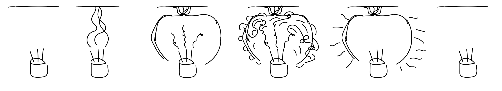
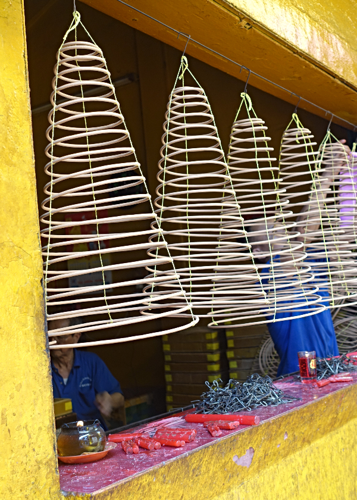

# Prototyping

## Smoke Catcher

When altars are placed up high, the incense smoke reaches the ceiling quickly and leaves a dark area and the surrounding area yellow. This problem has prevented one family from having an altar in their home to others devising make-shift solutions such as newspaper and tinfoil on the ceiling. 

To solve this, I imagine a flat surface mounted to the ceiling and when smoke reaches it, it transforms into a circular form to trap the smoke in to lilttle pickets of bubbles. Imagine a bubble like wrap material where each small pocket gets filled with smoke. 

It's important for the altar practice to have the smoke since it's how the living connect with the spirits. By having the soft robot come down from the ceiling, it not only helps to prevent damaging the walls and ceiling, but it also helps to retain the smoke for a longer period opposed to being absobred immediately. Also,  having a circular form with smaller bubble pockets helps to evenly distribute the smoke in all directions increasing chances of connecting with the spirit and at the same time not damaging the walls.

Vocabulary
- Thurification: never heard of this before but it means the act of incense-burning

Alternative Forms

A circular flat form that lives on the ceiling and comes down as a cone like structure. Need to figure out how to capture the smoke though...
