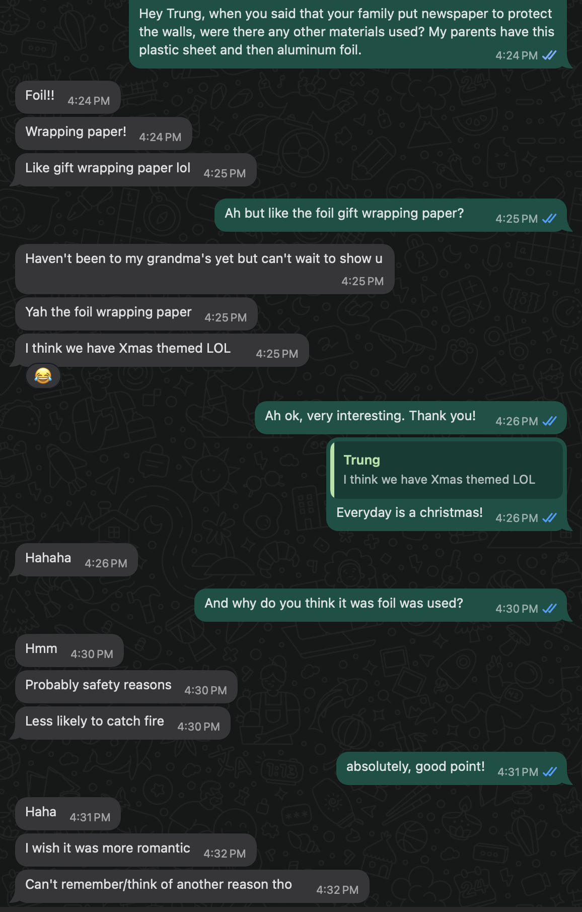
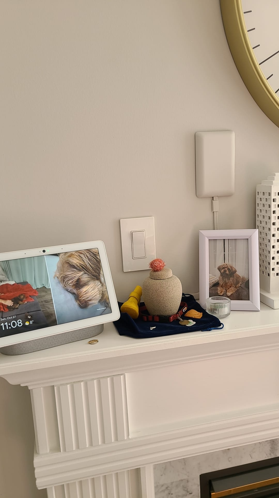
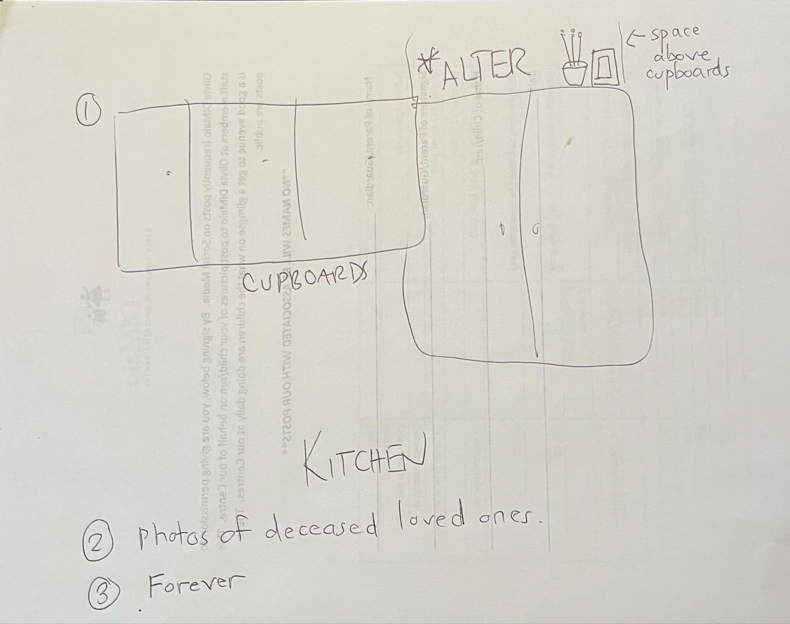
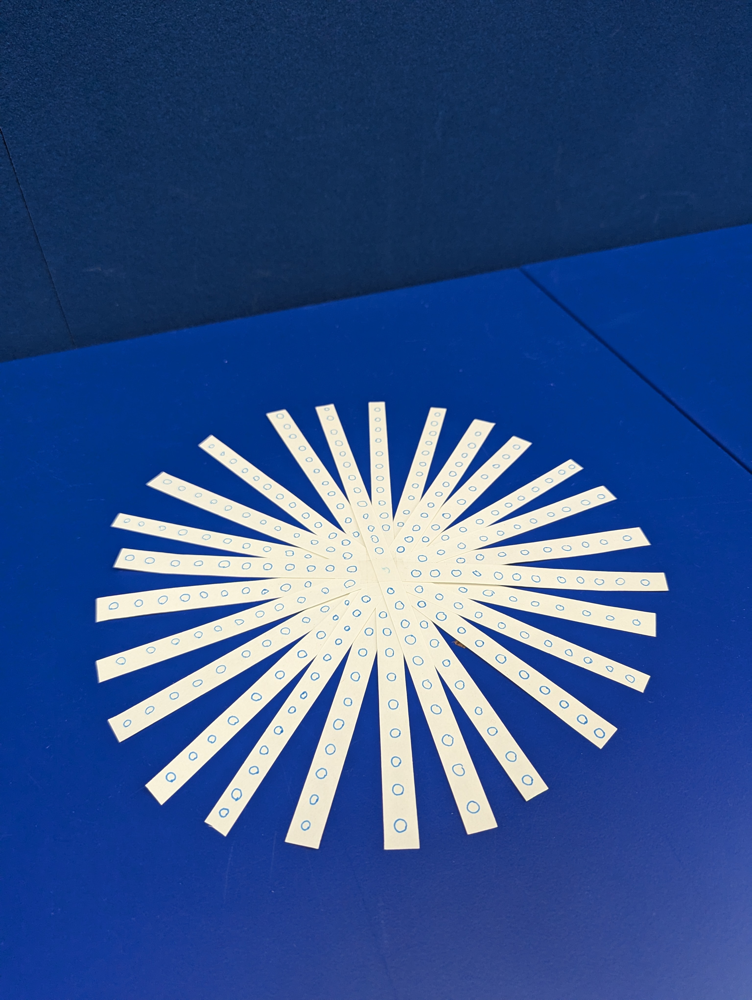
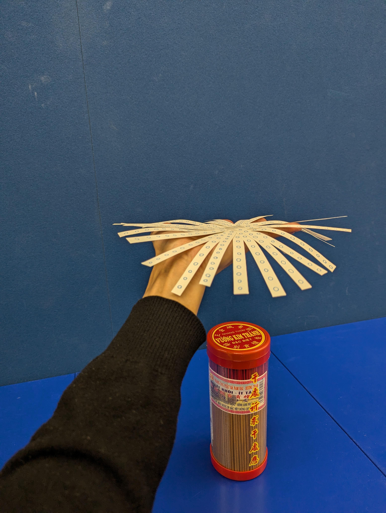
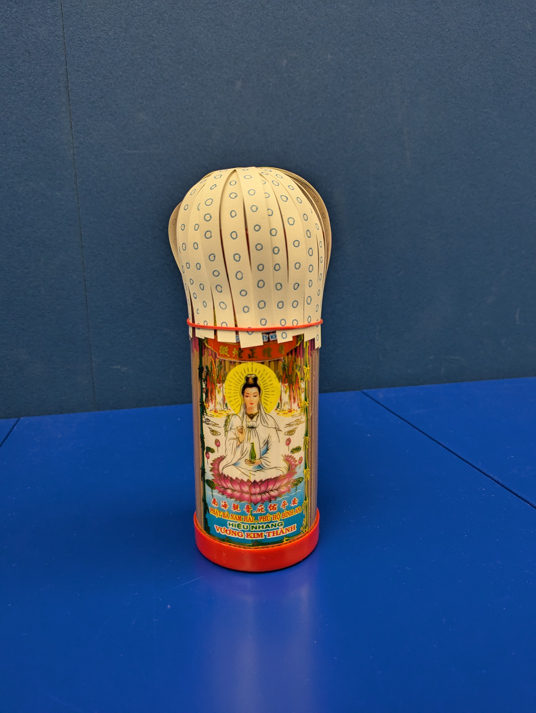

# Research and Prototyping

I remembered that my friend mentioned his family also used some sort of paper on the walls and ceilings. I wanted to confirm the material.

Note: They also use foil and the reason from him is for safety, so that the paper doesn't catch on fire.

Traditionally altars are not for pets but this tradition has been adpated for this family and perhaps to a western context where dogs are integrated into the domestic life and seen as companions rather than feral animals.

Note: digital frame and the fact that they leave treats out for Louie.

If I remember correctly, and like most houses, their cupboard to ceiling is also not that much space. 

## Prototype - Link

Made of strips where the skin has a bubble like feel

Placed on the ceiling directly above the incense.

Comes down to the incense to create a bulb to capture the smoke, and then releases through its bubbly skin.