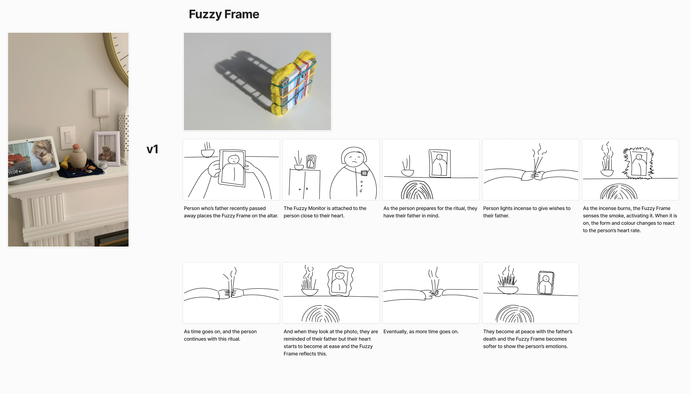
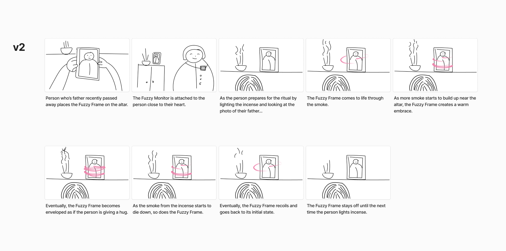
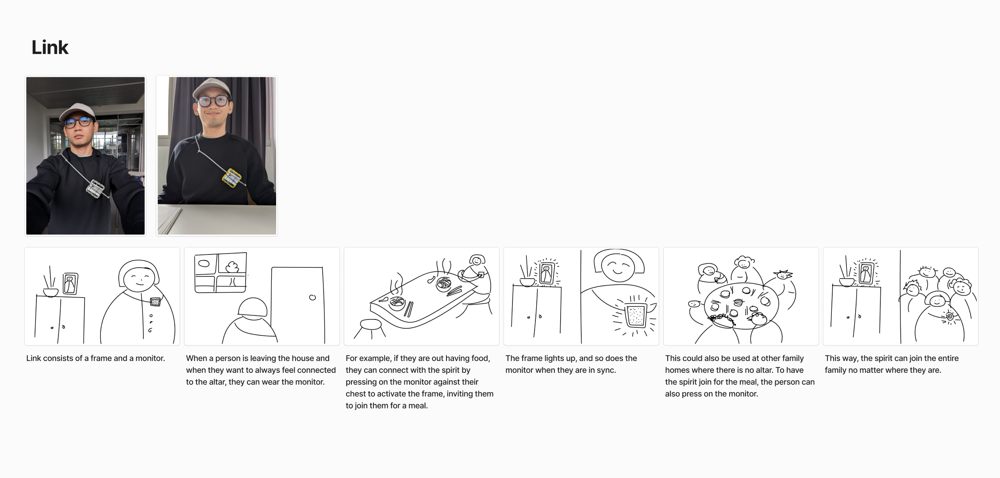
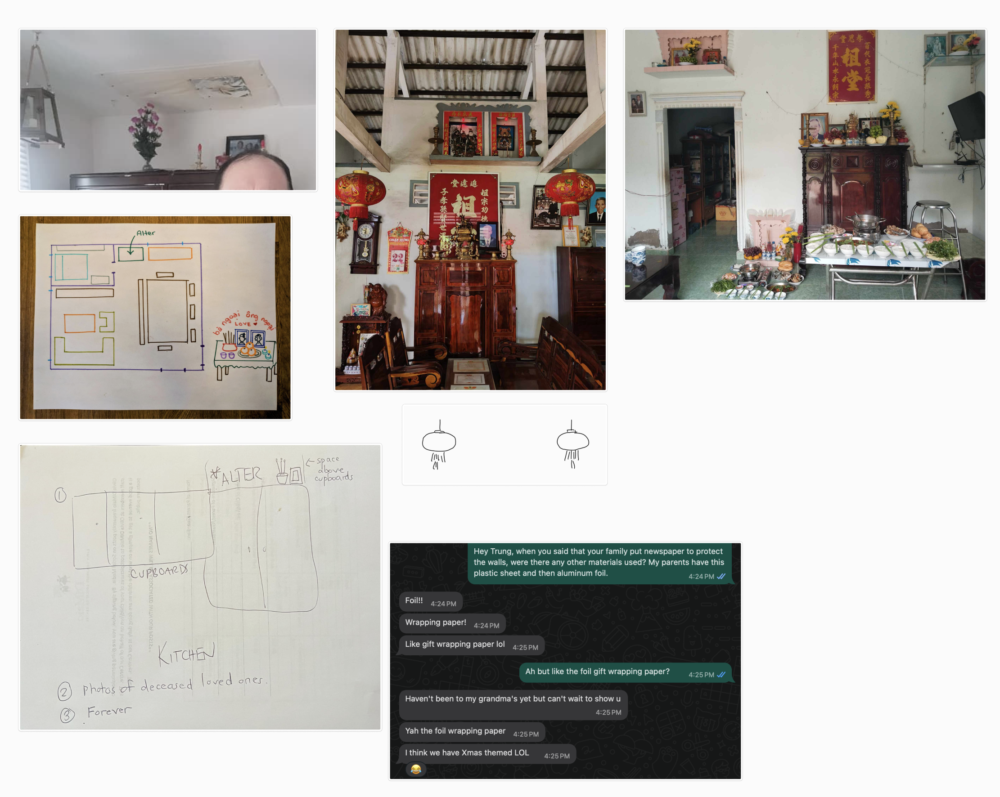
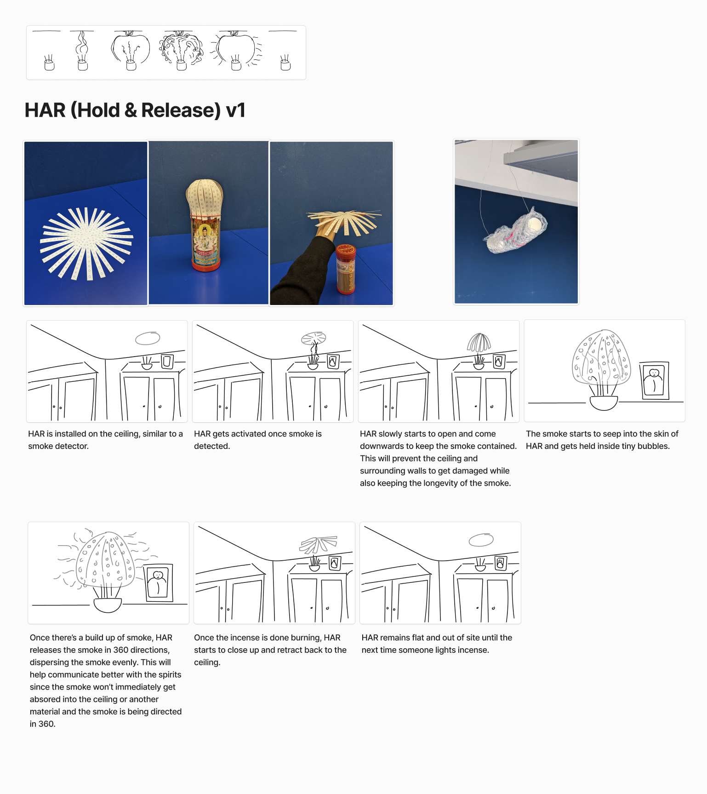
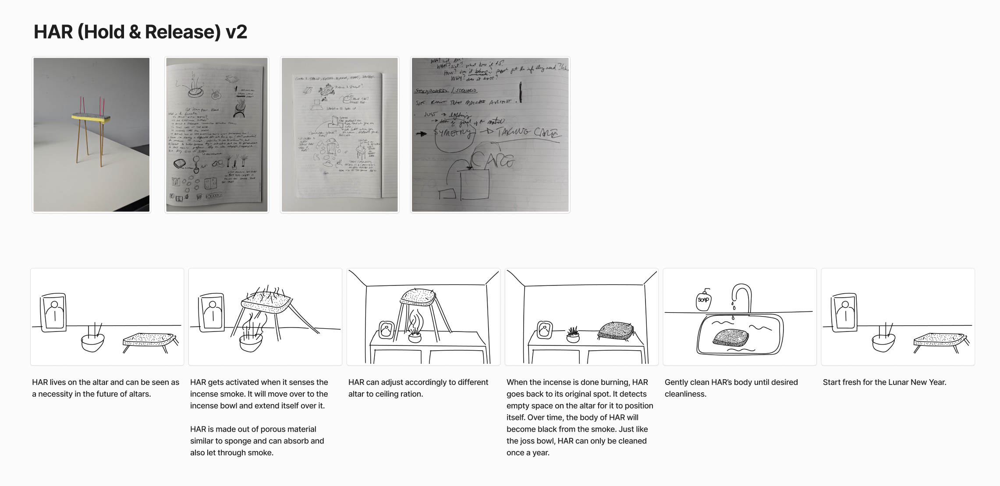

# Storyboards

## Fuzzy Frame

## Link

## HAR

Research

## Feedback
- Things are looking a bit neat, what about incorporating mess since grieving isn't so neatly packaged.
- Fuzzy Frame as a name didn't communicate the idea.
- Link, heart monitor, thinking of other objects such as lockets or even our mobile phones, we have photos of loved ones. 
- Where would Link live - on the body when out, but in the home, treat it as an object similiar to your keys. It's an essential item that you'll always take with you, so wherever you keep your keys like the entrance.
