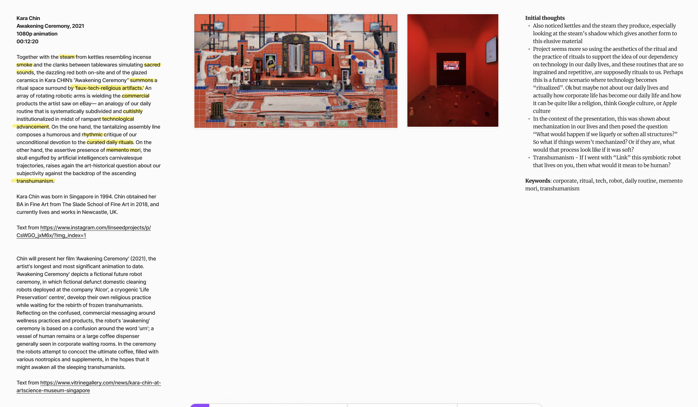
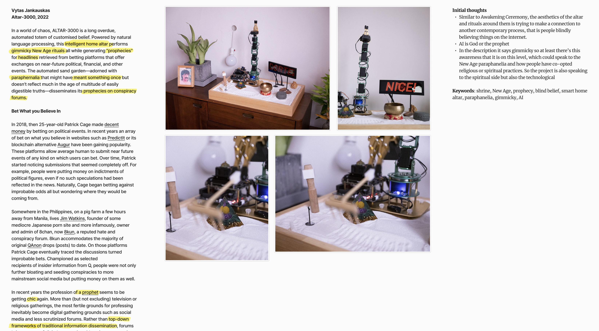
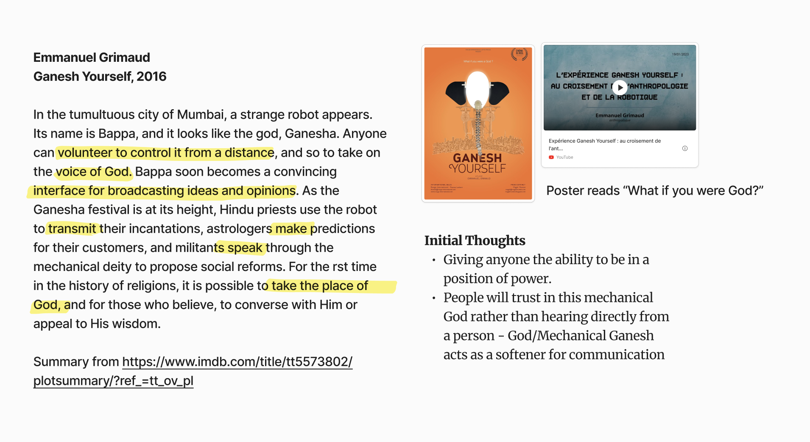

# Project References

Don't think these projects are relevant to what I'm triyng to achieve, which is to design for the altar and connection to the after lif, rather than use the aesthetics of religion and spirituality to make a critique on our contemporary life.
