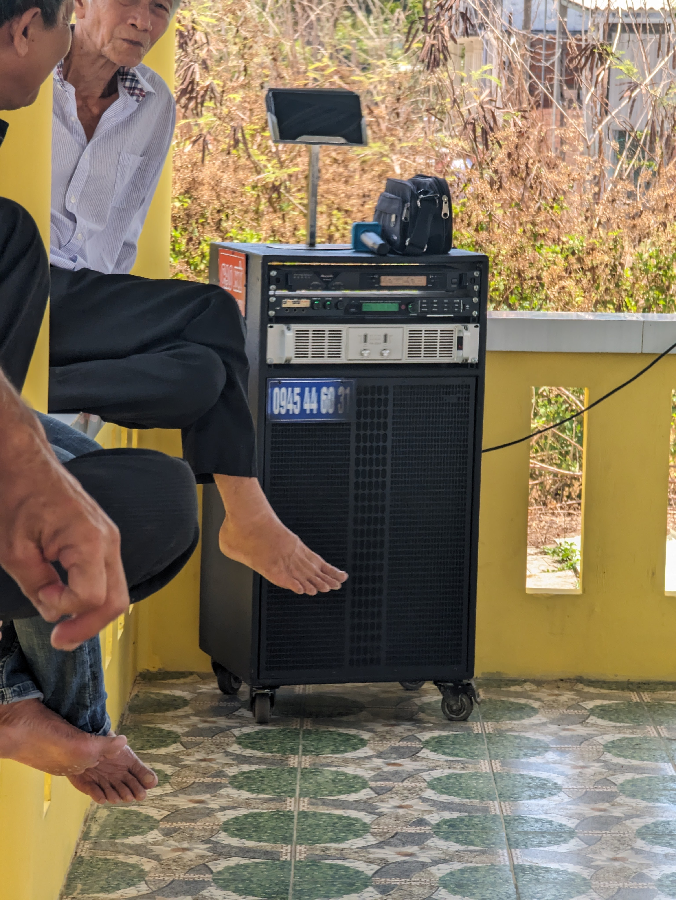

# Paper References

## Is ancestor worship a Vietnamese tradition? by Graz˙yna Szyman´ska-Matusiewicz

Notes
- The invention of tradition: "deliberate construct created for its present use-value" pg 3. Through this lens, we can look at tradition that can be created and altered for our own purposes. Especially when I hear the word tradition, I usually think of it being immobile, that it's meant to be maintained in its current form.
- Truyền thống - the closest word for tradition in Vietnamese. Truyền - transfer, as in transfering something from one generation to the next, and thống - means negotiation. pg 4. What's being negotiated (gained or lost) when transfering ideas, practices, and norms from one generation to the next?
- Tradition as a means of accompolishing goals such as maintaing social stability, having a harmonious state etc. pg 6
- Filial piety - our debt to our parents and ancestors
- "What really matters is not that people do things just so. It’s more important that they have a
heart for such things, and remember their family, their grandparents . . . and all the departed." - pg.11 from Liên
- Look into séance, calling the souls of the dead, communication between two worlds

## Cell phones for the spirits: ancestor worship and ritual economies in vietnam and its diasporas

Notes
- Spirit money, "cosmologies of credit" pg. 296. Paper money that is burnt to send to the after life. 
- Has expanded to contemporary technological goods such as cell phones, computers and ipads. pg 297
- "This raises the issue of whether fire is a destructive or a creative element,
as in these cases, fire and smoke are mediums of transfer,transmitting goods to the otherworld, thereby strengthening
the communication between the living and the dead." pg. 298; fire and smoke as a combination can be seen as a bad thing but in this case, it's actually good. And when talking to my partner who speaks Bengali, there are words in his native language to communicate good and bad smoke.
- China has votive items in ectasy, viagara and condoms, in Germany from Chinese supplier, luxury goods and fast food. In Hanoi tech media from Nokia and Samsung. pg. 301. Votive evolving with the times...but also is it because of capitalism and our attachment to material goods.
- "altars are not permanent homes for
the dead, but only meeting places from which the ancestorsvê.)“come and go” (.i
(Jellema 2007, 64) pg. 305. Altars being a fixed place within the home for the living but not the dead. Which leads to people burning transportation related goods for them to travel.
- Spirit medium being possessed and recorded to share via DVD, but can also be possessed again by watching the DVD, demonstrating that a possession can be done through a screen. pg. 308
- "One solution used by Vietnamese spirit mediums in the US is to
have master mediums in Vietnam send them photographs of votive offerings as replacements for the actual offering
(Fjelstad 2010, 62)." pg. 312. The image representation of the votive paper goods was sufficient. A copy of a copy kind of thing.
- "Visual representations are so powerful that they can even mediate other forms of mediation." pg. 313. Visuals can be a placeholder for the real, which is already the case with making paper copies.
- Burning passport to allow their deceased father to visit him in Germany pg. 315

## Sharing cultural values across generations in Vietnamese Australian families by Giang Thi Thanh Tran

Notes

- "The worship of ancestors is not a systematic religion, but it has a major influence on the daily life of Vietnamese people (Nguyen 1978; Nguyen 1987; Vu 2007)." pg. 20. Relates to the first paper about whether ancestor worship is a tradition.
- "It is harder for them to follow this calendar, as it is not used in Australia society. Further, it is unusual to have a big altar in their houses, as the burning incense can set off fire alarms." pg. 178. Supports my own research about burning incense in flats/rentals.
- Suggestion from a research participant is to worship the dead at a temple (similar to lineage hall?) since it's a warm place to stay and monks can take care of them. pg. 179. Monks as the afterlife caretakes.
- Another research participant says it's ok to remember them at the temple or put flowers on the grave and not necessary to have big death anniversary party. pg. 179. I wonder what it would mean when something is out of sight, out of mind. Especially taken into consideration the previous paper where visual representation mattered very much to mediate between the other world. 
- A different research participant doesn't expect their son to have an altar for them as they may have another way to remember them. pg. 180. 
- Sons of refugees not really interested in carrying on this ritual. pg. 180. Perhaps this is an opportunity to re-think the altar and ways to remmeber and stay connected to your deceased love one. What does it mean in today's busy world and Vietnamese adaptaption to their host countries?

## [Ancestor Veneration in Vietnam: Altars, Funerals and Parties](https://www.emmahurt.com/blog/2015/12/11/ancestor-veneration-in-vietnam-altars-funerals-and-deathday-parties)
- "Saigon especially is known for some crazy, drunken funeral parties. If the deceased loved karaoke, you sing karaoke until the wee hours of the morning. As one southerner told me, no one in the neighborhood will complain about the noise because they know it’s a funeral."

## Family Cúng in April 2024

Karaoke machine never far away

Similar to my family. They love karaoke and definitely in the country side you can hear neighbours sing their hearts out into the morning hours. When I was in Vietnam this summer, we held a big cúng for my entire family, where the tombs were in the backyard. It turned into a party with obviously karaoke.

11:32 AM
<video width="320" height="240" controls>
  <source src="images/Vietnam_2024-family_cung_2.TS.mp4" type="video/mp4">
</video>
1:28 PM
<video width="320" height="240" controls>
  <source src="images/Vietnam_2024-family_cung_1.TS.mp4" type="video/mp4">
</video>

