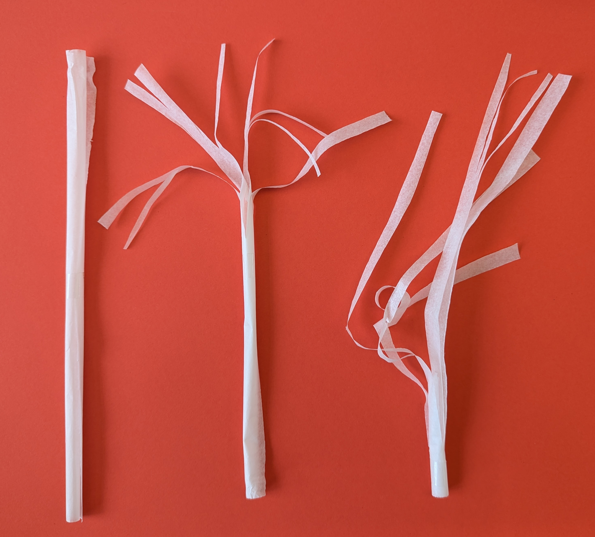
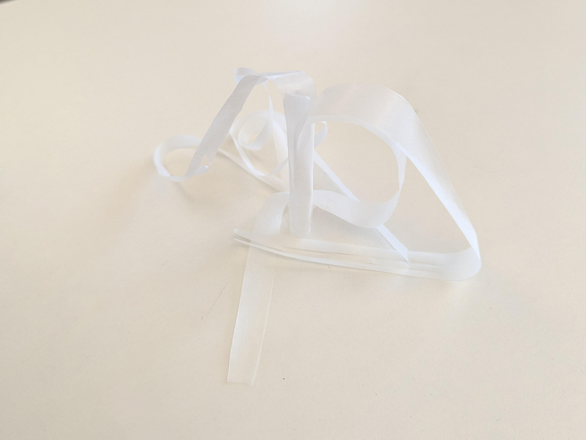
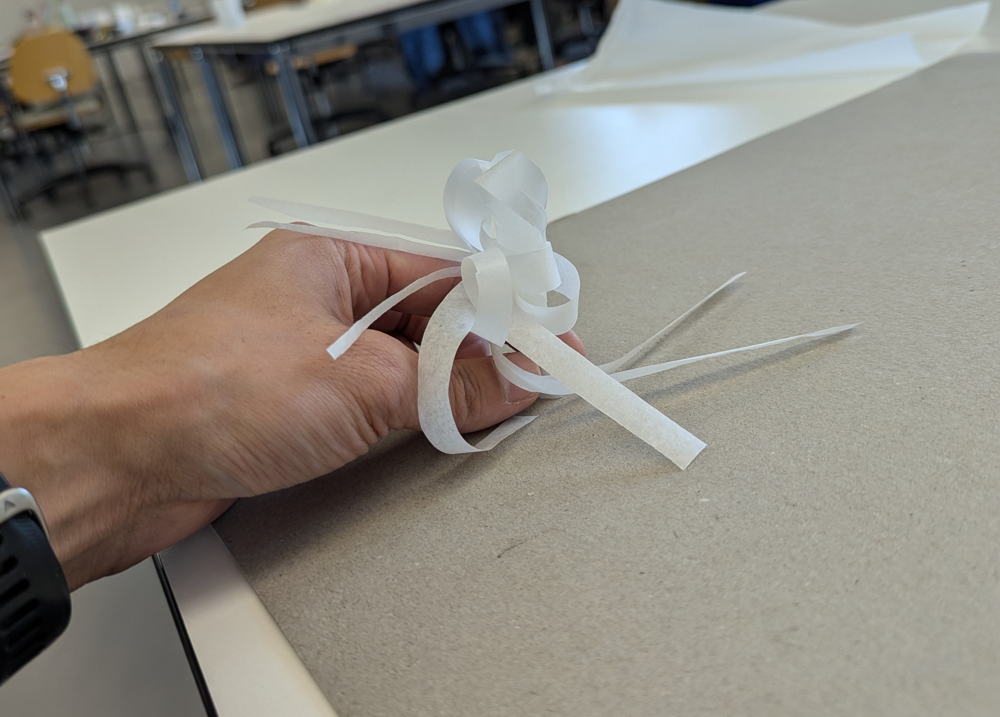
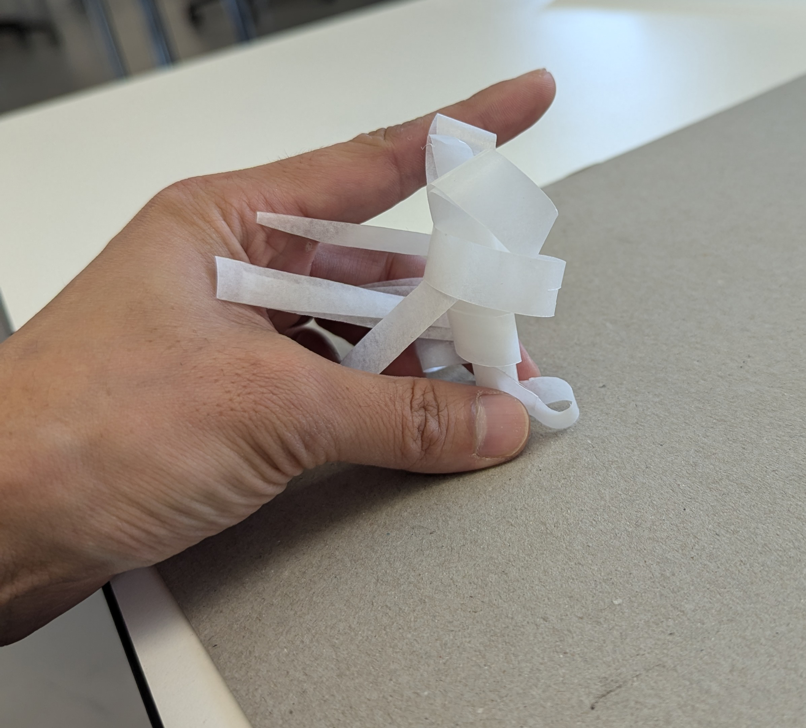
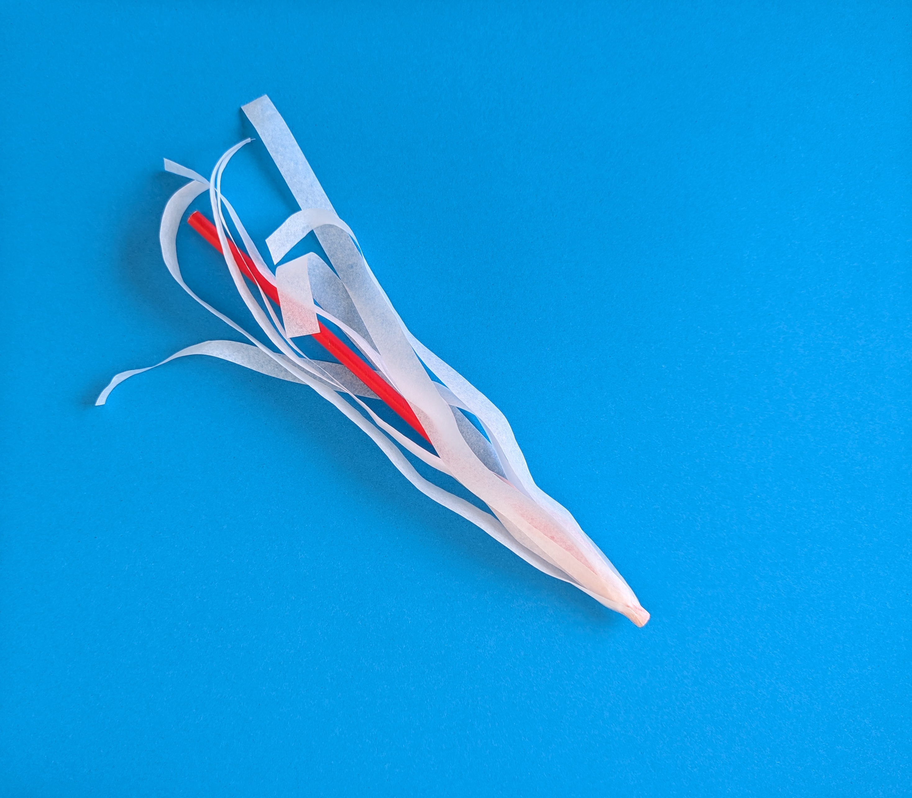
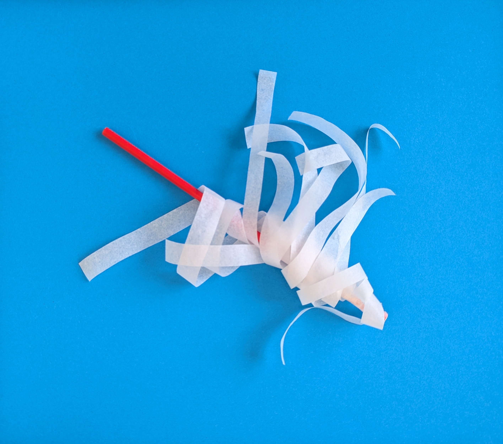
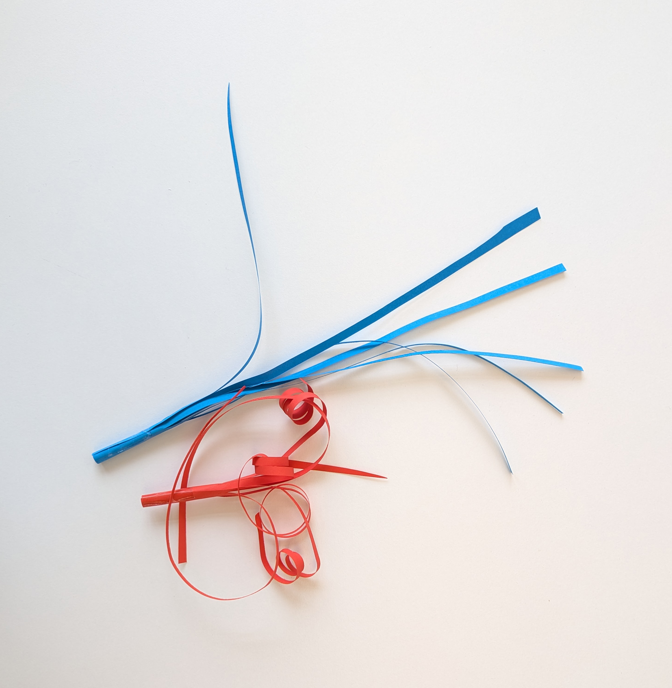
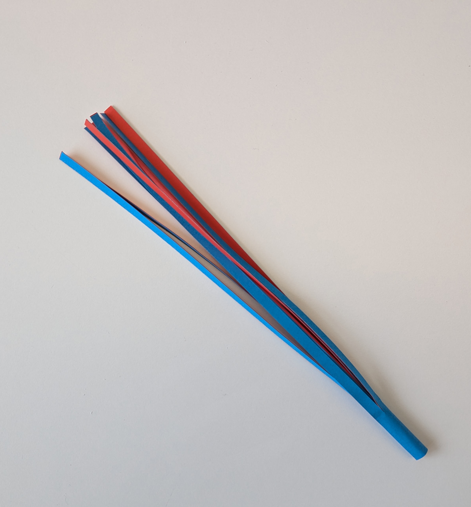
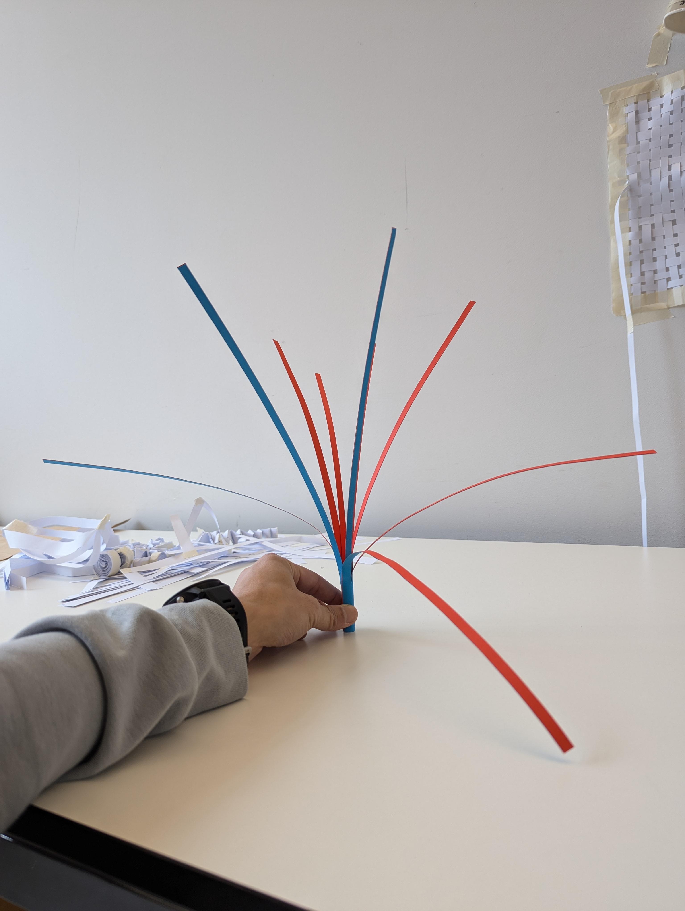

# Paper Prototypes

This week we are led by Laure KrayenBuhl to explore form and material. Through our initial conversation, the direction we decided on is to explore incense and smoke through paper.

