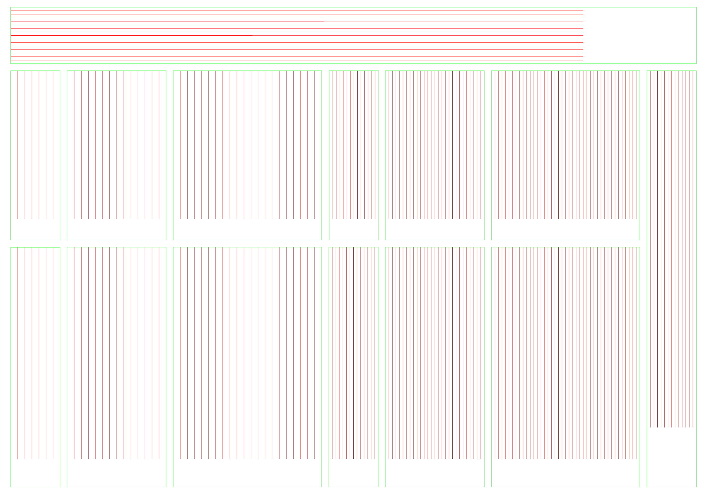
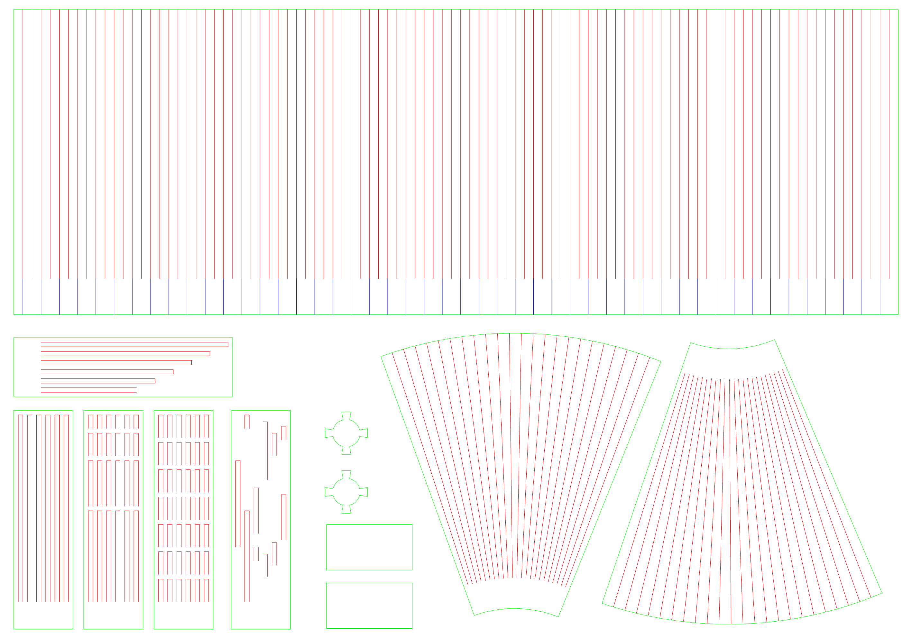
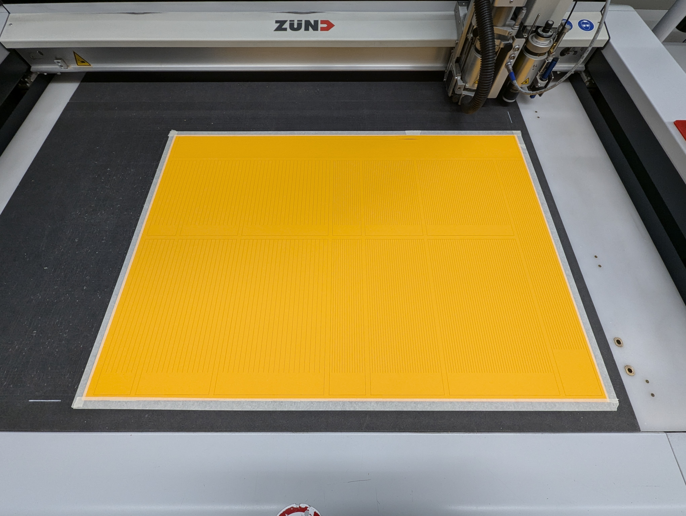
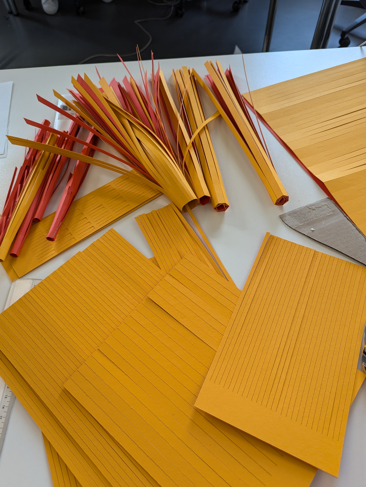
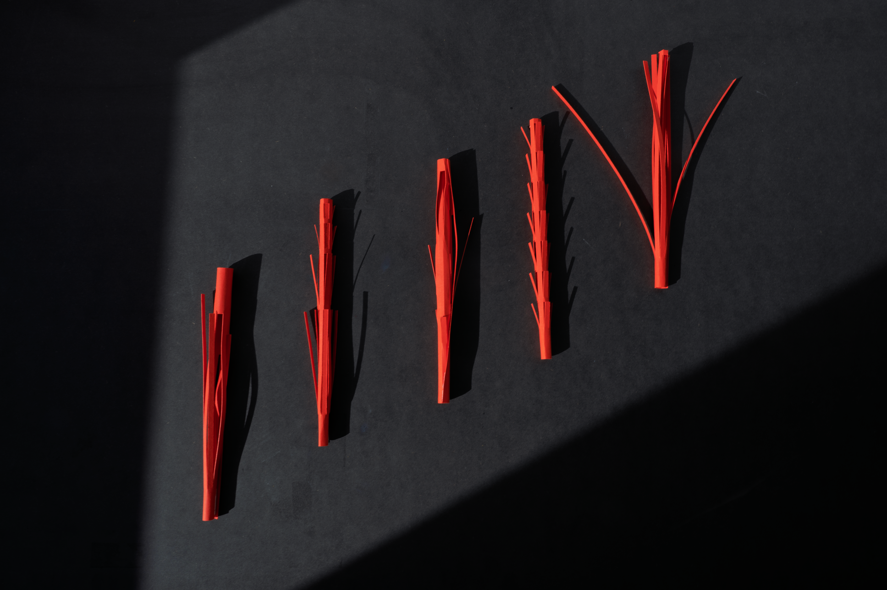

# Refined Paper Explorations

Taking into account the Zund cutter at the prototyping centre, I took advantage of precise cuts and forms that would be difficult to do by hand.

## Cutting Files

## Cutter and Panels

## Outcome

To hear and see some in movement, here is an [explainer video](https://www.instagram.com/p/DCZI73RMu5Z/).