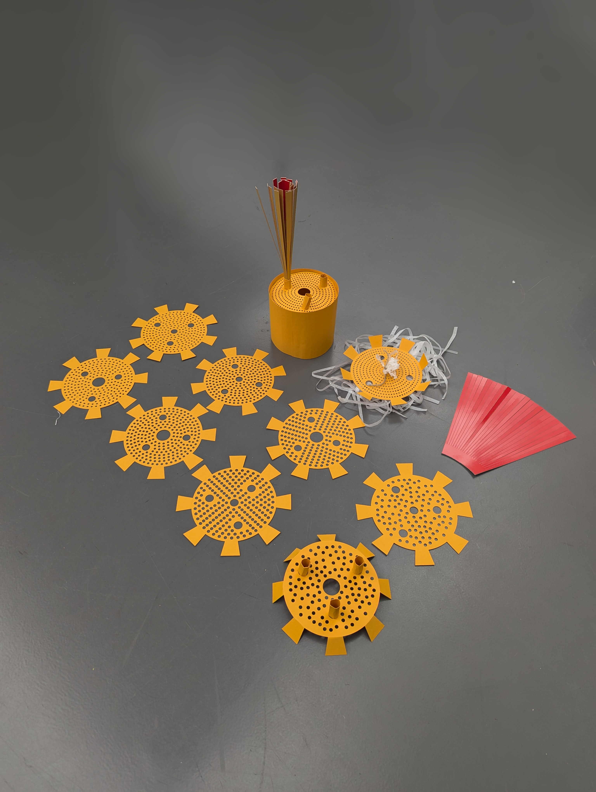

# Protyping

3D printing fail but tiny win for getting the poles to go through the holes of the fan case

[Watch video: 80mm fan test](https://youtube.com/shorts/BcT5whCbBD4?feature=share)

Links, maybe helpful? Looking into maximizing air flow in a container

https://engineering.stackexchange.com/questions/7228/how-to-increase-the-air-flow-rate-through-a-dust-separating-cyclone

https://web.archive.org/web/20131210202748/http://www.fi.edu/flights/first/makebigger/index.html

https://www.youtube.com/watch?v=8tk1qf2Ybtc

Ardunio with 4 Wire Fan

https://www.youtube.com/watch?time_continue=473&v=UJK2JF8wOu8&embeds_referring_euri=https%3A%2F%2Fwww.google.com%2Fsearch%3Fq%3Dcentrifugal%2Bfan%2Bardunio%26oq%3Dcentrifugal%2Bfan%2Bardunio%26gs_lcrp%3DEgZjaHJvbWUyBggAEEUYOTIJCAEQIRgKGKABM&source_ve_path=MTM5MTE3LDM2ODQyLDI4NjY2

Need a good amount of space below, seems like 80mm to have good air intake. In addition, need to direct the air. Can potentially create a tunnel and maybe add a venturi opening. Venturi effect squeezes air more compactly when coming in which creates a higher air pressure.

