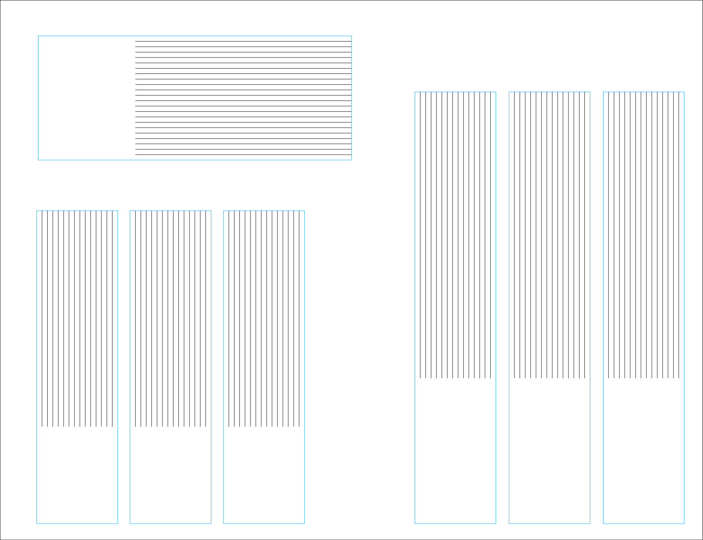
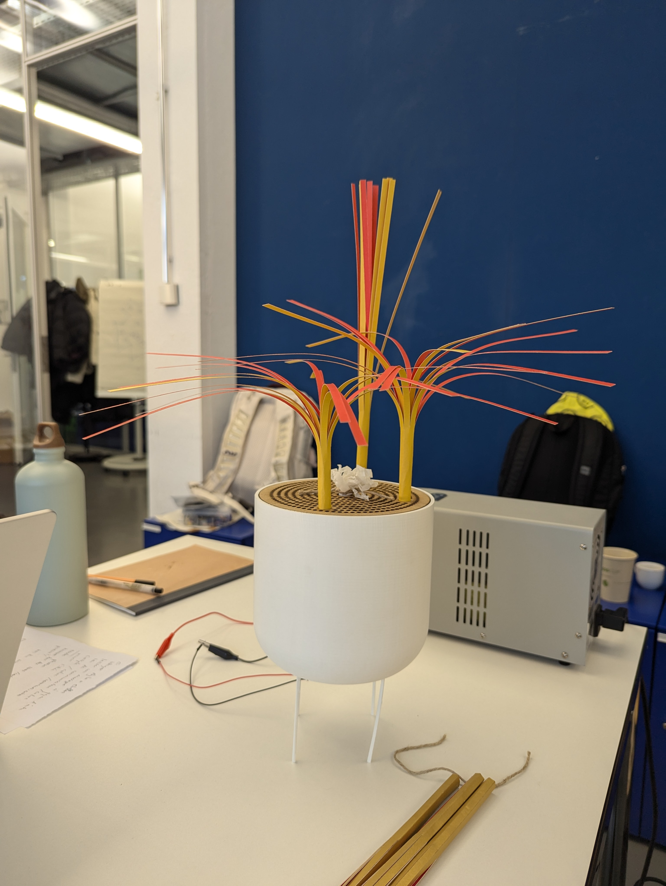
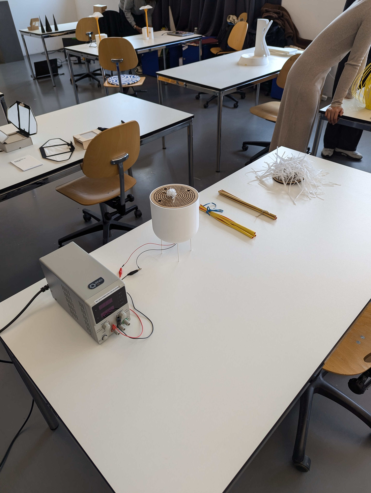

# Refining Prototypes

Acquired duotone paper which helps with the movement of the incense. But it looks like some fall and some stand up straight. I don't want thme to completely fall because it interferes with the smoke strands.

If I want them to stand up straight, I need to cut the paper against the grain.

Will make the vessel in wood.

[Watch video on prototyping progress](https://www.instagram.com/p/DDmxHLnM3QX/)

## Test Day

### Observations
- People were careful with the object.
- Not clear that they can lift up the lid. 
- Why not have equial distances for the incense holes.
- Strands get caught underneath, people not opposed to having it shorter. (What if I have some strands in the incense like previous prototypes...)
- The string/rope was prefered.
- The more strands that covers the lid is difficult to find the holes. 