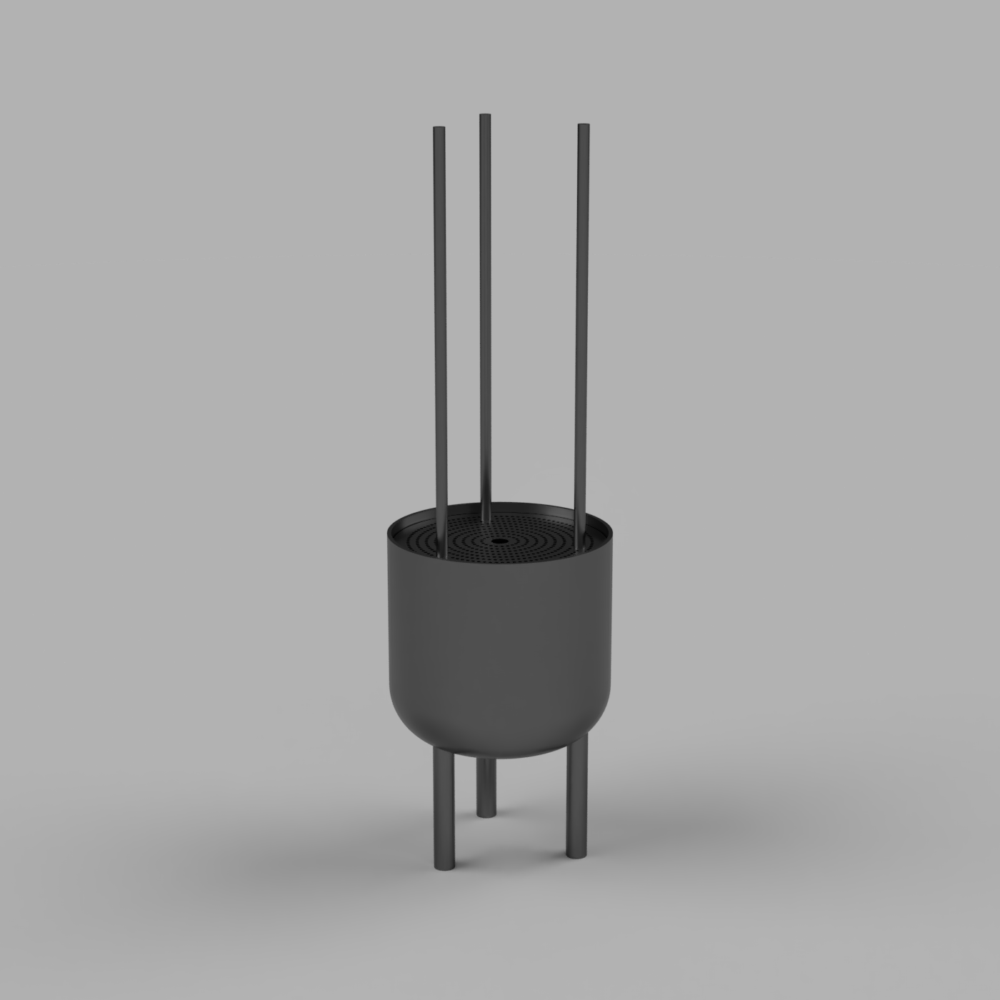

# The end, but is it really...

Some final things that I did to wrap up the project is making the box where the incense are placed and deciding on what material for the lid for the wood object.

Went with a grey MDF for the lid to create little contrast to the wood but also have a soft feeling. The grey can also be reprsenting "ashes".

The red MDF for the box is referening traditional incense holders and to symbolize life force and luck.

## Final Images

See a more concise version of the GitHub repo in [presentation format](images/250115_HEAD-MD1_Soft-Robots_Peter-Ha_A_Burning_Desire_to_Remember.pdf).